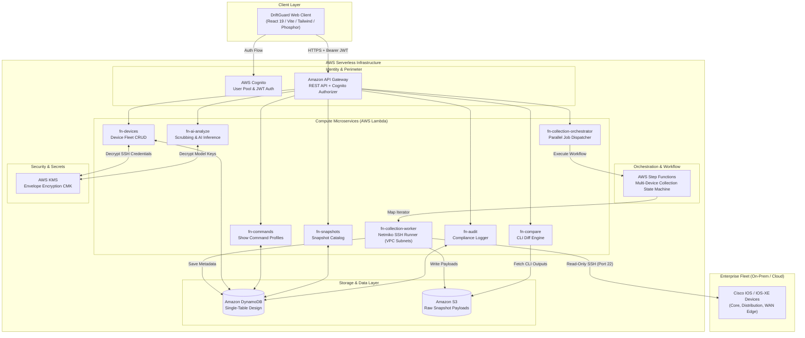

# DriftGuard

<div align="center">

```
             /\
            /  \
           / /\ \
          | |  | |    ============================== [BASELINE TRACE]
          | |  | |                  \
          | |  | |                   \
          |  \/  |                    \
           \    /                      * [CONVERGED TRACE NODE]
            \  /
             \/       "Before. After. Understood."
```

**Enterprise Network Change Verification & AI-Assisted Drift Analysis**

[](https://www.typescriptlang.org/)
[](https://react.dev/)
[](https://vitejs.dev/)
[](https://tailwindcss.com/)
[](https://python.org/)
[](https://aws.amazon.com/serverless/)
[](https://github.com/ktbyers/netmiko)
[](LICENSE)

</div>

---

## Overview

**DriftGuard** is an enterprise desktop verification instrument designed for network operations centers (NOC) and network engineering teams managing mission-critical Cisco infrastructure.

During live maintenance windows, undocumented configuration drift, routing convergence anomalies, and flapping adjacencies introduce unacceptable risk. DriftGuard enforces a disciplined, 3-beat operational workflow:

1. **Before**: Collect structured `show` command baselines prior to maintenance.
2. **After**: Capture post-change verification snapshots across your fleet.
3. **Understood**: Compute line-by-line CLI diffs and generate structured, advisory AI impact assessments categorized by blast radius and severity.

DriftGuard functions as an engineered flight instrument panel — calm, technical, desktop-first, and strictly read-only.

---

## Key Capabilities

### 1. Guaranteed Cisco Read-Only Show Command Execution
- DriftGuard enforces an immutable whitelist of diagnostic `show` commands (`show ip route`, `show ip bgp summary`, `show interfaces status`, `show running-config`, etc.).
- State-mutating commands (`config t`, `reload`, `write erase`, `boot`, `copy`) are blocked at three independent layers: frontend validation, API Gateway regex enforcement, and Lambda command execution sanitization.

### 2. Temporal Snapshot Timelines
- Stores raw CLI telemetry in Amazon S3 with metadata indexed in DynamoDB using a high-performance single-table design.
- Distinguishes between `pre_change` (Baseline) and `post_change` (Verification) states for audit defensibility.

### 3. Real-Time CLI Diff Analysis Engine
- Computes unified, line-by-line CLI output diffs directly in the browser or via backend compute.
- Highlights added routes, dropped BGP peers, interface status flips, and metric shifts with high-contrast Voltage syntax highlighting (`bg-[#c8ff00]/10 text-[#c8ff00]`).

### 4. Advisory AI Impact & Blast Radius Analysis
- Evaluates raw diffs against routing stability, forwarding behavior, MTU parity, and redundancy paths.
- Categorizes findings into a standardized 5-tier severity ramp:
  - **Critical** (`#DC2626` / `rose-600`): Active outages, blackholed subnets, core adjacency loss.
  - **High** (`#F97316` / `orange-500`): Redundancy degradation, primary path failover.
  - **Medium** (`#FBBF24` / `amber-400`): Metric anomalies, unexpected route advertisements.
  - **Low** (`#38BDF8` / `sky-400`): Counter increments, cosmetic description changes.
  - **Informational** (`#94A3B8` / `slate-400`): Routine administrative events.
- Employs a strict **3-part diagnostic model**:
  1. **What happened** (Technical observation)
  2. **What it means** (Operational blast radius)
  3. **What to do next** (Specific verification or rollback commands)
- **Advisory AI Disclaimer**: DriftGuard analysis is framed strictly as advisory guidance (`"DriftGuard analysis suggests…"`). Operational authority remains with the senior network engineer.

### 5. Enterprise NetOps Security
- **AWS KMS Envelope Encryption**: Fleet SSH credentials, private keys, and AI provider API keys are encrypted with customer-managed keys (CMK) before storage in DynamoDB.
- **Pre-Inference Secret Scrubbing**: High-entropy strings, MD5 authentication keys, SNMP communities, and passwords (`password 7`, `secret 5/8/9`) are regex-scrubbed before sending to AI evaluation models.
- **Immutable Audit Logging**: Every snapshot capture, diff inspection, and export event is cryptographically recorded in an immutable audit ledger.

---

## System Architecture



---

## Quickstart Guide

DriftGuard supports two operational workflows:
1. **Local Simulation Mode**: Standalone React client with zero cloud dependencies and rich preloaded mock fleet data.
2. **Production AWS Serverless Deployment**: Full cloud infrastructure deployed via AWS SAM CLI.

### Option 1: Standalone Local Simulation (Fastest)

Ideal for UI evaluation, demo presentations, and frontend development.

#### Prerequisites
- Node.js 18+ or 20+
- npm 9+ or pnpm

#### Setup Steps

```bash
# 1. Clone the repository
git clone https://github.com/your-org/driftguard.git
cd driftguard/frontend

# 2. Install dependencies
npm install

# 3. Launch the development server
npm run dev
```

The web application will be accessible at:
```text
http://localhost:5180
```

#### Preloaded Simulation Features
- **Default Operator Account**: `admin` / `admin123` (or any string in demo mode).
- **Preconfigured Cisco Fleet**: `core-sw01.lax`, `edge-rtr01.sfo`, `dist-sw02.ord`, and `dc-spine01.iad`.
- **Pre-computed Baseline & Verification Snapshots**: Includes live diffs with interface flapping, BGP neighbor drop, and OSPF metric divergence.
- **Simulated Netmiko SSH Terminal**: Streaming mock terminal events with realistic SSH handshake logs and CLI execution feeds.

---

### Option 2: Production AWS Cloud Deployment

Deploy the complete serverless backend to your AWS account.

#### Prerequisites
- AWS CLI configured with administrator privileges (`aws configure`)
- AWS SAM CLI installed (`sam --version`)
- Python 3.12 installed
- Docker installed (for local containerized testing)

#### Setup Steps

```bash
# 1. Navigate to the backend directory
cd backend

# 2. Validate SAM template
sam validate --template template.yaml

# 3. Build serverless microservices
sam build --use-container

# 4. Deploy to AWS
sam deploy --guided
```

#### Key SAM Configuration Parameters
- `ProjectName`: `driftguard`
- `Environment`: `prod` / `staging`
- `VpcId`: Target VPC with Direct Connect / VPN connectivity to your Cisco network fleet.
- `PrivateSubnetIds`: Subnets where `fn-collection-worker` Lambda instances are spawned to access device SSH ports.
- `DeviceSshKeyKmsAlias`: Alias for the customer-managed KMS key encrypting SSH secrets.

#### Connecting Frontend to AWS
After `sam deploy` completes, copy the generated API Gateway endpoint URL into `frontend/.env`:

```env
VITE_API_BASE_URL=https://xxxxxxxxxx.execute-api.us-east-1.amazonaws.com/prod
VITE_COGNITO_USER_POOL_ID=us-east-1_xxxxxxxxx
VITE_COGNITO_CLIENT_ID=xxxxxxxxxxxxxxxxxxxxxxxxxx
```

Then build and distribute the frontend bundle:

```bash
cd frontend
npm run build
```

The compiled assets in `frontend/dist/` can be served via Amazon CloudFront + Amazon S3 or your enterprise internal web host.

---

## Repository Structure

```text
d:\DeltaNet/
├── .agents/                      # Multi-agent operating protocol and skills
│   ├── AGENTS.md                 # Autonomous multi-agent software engineering protocol
│   └── skills/                   # Specialist skill definitions
│       ├── agent-orchestrator/   # Lead intake, scope decomposition, gating
│       ├── agent-architect/      # Serverless & Cisco CLI data models
│       ├── agent-implementer/    # Python Lambda & React 19/TS components
│       ├── agent-tester/         # Terminal execution & automated verification
│       └── agent-reviewer/       # Cisco read-only & KMS envelope security review
├── backend/                      # AWS Serverless SAM microservices
│   ├── functions/                # Lambda function handlers
│   │   ├── devices/              # Device inventory & credential management
│   │   ├── commands/             # Show command profile catalog
│   │   ├── snapshots/            # Snapshot indexing & S3 retrieval
│   │   ├── collection/           # Netmiko SSH collection workers
│   │   ├── compare/              # CLI line-by-line diff computation
│   │   ├── ai_analyze/           # Secret scrubbing & AI impact reasoning
│   │   ├── audit/                # Immutable compliance audit logger
│   │   └── settings/             # Operator preferences & model keys
│   ├── shared/                   # Shared Pydantic models, KMS cryptography, S3 helpers
│   ├── state_machines/           # AWS Step Functions JSON definitions
│   └── template.yaml             # Complete AWS SAM infrastructure-as-code
├── frontend/                     # React 19 + Vite desktop application
│   ├── public/                   # Favicon, OpenGraph card, robots.txt, sitemap.xml, llms.txt
│   ├── src/
│   │   ├── components/           # Modular UI components
│   │   │   ├── auth/             # 2-column operator authentication & showcases
│   │   │   ├── common/           # BrandLogo, Badge, Card, ToastContainer, Pagination
│   │   │   ├── diff/             # LineByLineDiffViewer, SideBySideDiffViewer
│   │   │   └── layout/           # Instrument navigation sidebar & header
│   │   ├── pages/                # Page controllers
│   │   │   ├── auth/             # LoginPage, RegisterPage
│   │   │   ├── legal/            # PrivacyPolicyPage, TermsPage
│   │   │   ├── DashboardPage.tsx # Fleet status, KPI cards, recent snapshots
│   │   │   ├── CollectPage.tsx   # "Run collection" execution & streaming logs
│   │   │   ├── ComparePage.tsx   # Snapshot selector & live CLI diff viewer
│   │   │   ├── AIAnalysisPage.tsx# DriftGuard Analysis advisory report
│   │   │   ├── CommandSetsPage.tsx# Show command sequence profiles
│   │   │   ├── DevicesPage.tsx   # Cisco device fleet inventory
│   │   │   └── SettingsPage.tsx  # AI model configuration & KMS settings
│   │   ├── store/                # Zustand application store & demo fixtures
│   │   └── index.css             # shadcn/ui-compatible HSL theme tokens & Voltage rules
│   ├── package.json
│   └── vite.config.ts
├── .gitignore                    # Monorepo git exclusion rules
└── README.md                     # This document
```

---

## Multi-Agent Autonomous Engineering Protocol

This repository is governed by the multi-agent operating protocol codified in [.agents/AGENTS.md](file:///.agents/AGENTS.md). 

Every engineering task enters through the **Lead Orchestrator** and progresses sequentially through specialized personas:

```
                      +-----------------------------+
                      |      Lead Orchestrator      |
                      |   (Task Intake & Manager)   |
                      +--------------+--------------+
                                     |
               +---------------------+---------------------+
               |                     |                     |
               v                     v                     v
     +-----------------+   +------------------+   +------------------+
     |  Architect      |   |   Implementer    |   |     Tester       |
     | (Design & Plan) |   | (Code Execution) |   | (Build & Verify) |
     +-----------------+   +------------------+   +------------------+
                                                           |
                                                           v
                                                  +------------------+
                                                  |    Reviewer      |
                                                  |  (Verification)  |
                                                  +------------------+
```

### The 4-Phase Sequential Gate
1. **Phase 1: Architecture (`@orchestrator` -> `@architect`)**: System impact analysis, API contract design, Cisco command safety audit.
2. **Phase 2: Implementation (`@implementer`)**: Production code adhering to DriftGuard design standards (React 19, Voltage `#c8ff00`, Pydantic v2, dark glassmorphism).
3. **Phase 3: Automated Testing (`@tester`)**: Strict build validation (`npm run build`, `pytest`), clean compilation with 0 regressions.
4. **Phase 4: Security & Compliance Review (`@reviewer`)**:
   - **Cisco Read-Only Enforcement**: Ensures no mutating commands (`config t`, `write erase`, `reload`).
   - **KMS Envelope Encryption**: Audits SSH credentials and API key storage paths.
   - **Zero-Emerald Law**: Verifies verification states use unified Voltage tokens with zero emerald in source code.

---

## Design System & Voltage Identity

DriftGuard adheres to a strict design language inspired by professional flight and laboratory instruments:

- **Primary Brand Accent ("Voltage")**: `#C8FF00` (Electric acid lime) on dark surfaces (`slate-950`). Always paired with `text-slate-950 font-bold` on solid surfaces.
- **Light Mode Adaptation**: `#4D7C0F` (Lime-700) for AAA contrast compliance on white surfaces (`#C8FF00` is illegal for text or thin strokes on light backgrounds).
- **Surface Density Constraint**: Voltage coverage is strictly capped below 10% on any screen to maintain visual hierarchy.
- **Zero-Emerald Law**: Emerald is completely eliminated. Positive diff additions use `bg-[#c8ff00]/10 text-[#c8ff00]`, and verified states use unified Voltage checkmark badges.
- **Strict Button Terminology**: Collection is `"Run collection"`, comparison is `"Compare"`. All secondary buttons are concise 1 to 2 words (`Inspect`, `Analyze`, `Export`, `Register`).

---

## Verification & Code Quality

Run automated validation suites across both frontend and backend:

```bash
# Frontend TypeScript & Vite Production Build
cd frontend
npm run build

# Frontend Linting
npm run lint

# Backend Unit Tests & Syntax Verification
cd ../backend
pytest
```

---

## Operational Safety Disclaimer

> **IMPORTANT**: DriftGuard provides advisory analytical tooling designed to assist network engineers during change windows. DriftGuard does not execute state-modifying configuration changes or autonomous remediation commands. All configuration adjustments, failover verifications, and rollbacks require manual confirmation by a qualified network engineer in accordance with your organization's change control procedures.

---

## License

Copyright © 2026 DriftGuard Network Systems. All rights reserved.
For licensing and commercial terms, review [Terms of Service](file:///frontend/src/pages/legal/TermsPage.tsx) and [Privacy Policy](file:///frontend/src/pages/legal/PrivacyPolicyPage.tsx).
