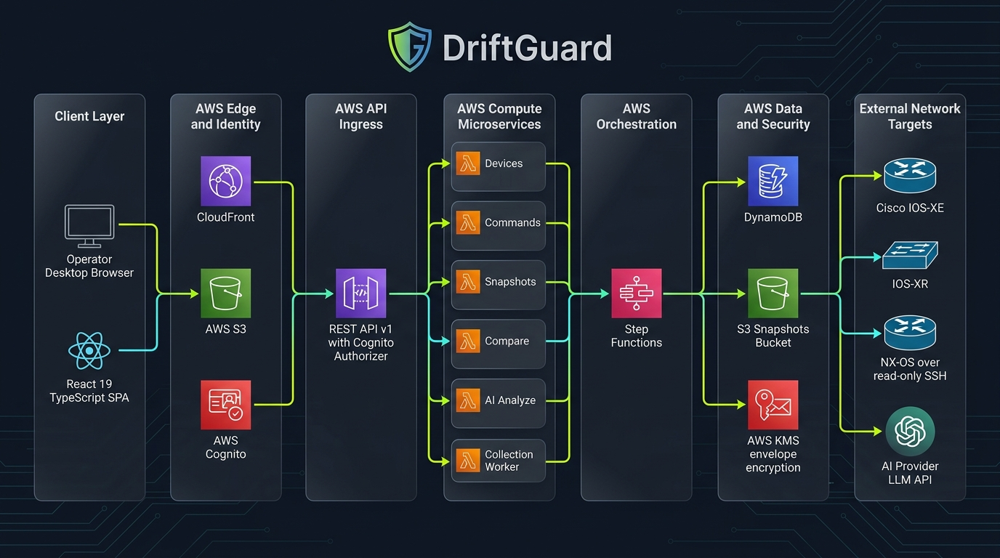
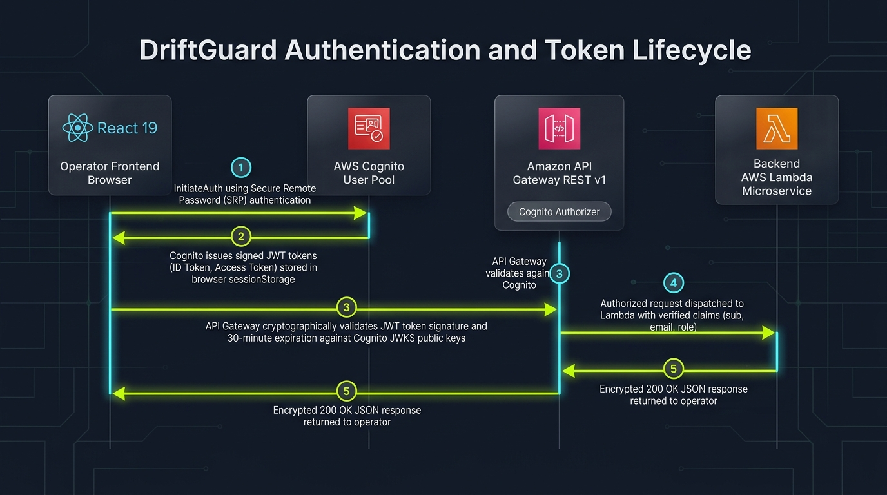
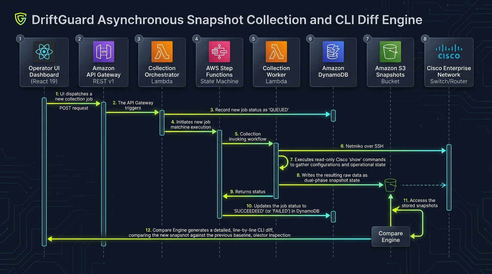

# DriftGuard System Architecture & Communication Specification

> **DriftGuard**: *"Before. After. Understood."*  
> Enterprise Network State Verification & Drift Analysis Platform

---

## 1. Executive Summary & Design Principles

DriftGuard is an enterprise desktop verification instrument engineered to capture, analyze, and diff network device configurations and operational states before and after maintenance windows. Built on a serverless AWS foundation with a React 19 desktop frontend, the system guarantees operational safety, cryptographic security, and predictable resource utilization within AWS Free Tier limits.

### Core Architectural Tenets
- **Cisco Read-Only Enforcement**: Execution of state-mutating commands (`configure terminal`, `reload`, `write erase`, etc.) is blocked at the application and protocol layer. DriftGuard executes strict `show` inspection commands only.
- **Envelope Encryption**: Device SSH credentials and AI provider keys are encrypted before persistence in DynamoDB using dedicated AWS KMS Customer Master Keys (CMKs).
- **Hybrid Data Tiering**: DynamoDB single-table design houses relational entities and small CLI outputs (< 4 KB), while large snapshot dumps and structural diffs are offloaded to Amazon S3 with automated 365-day lifecycle rules.
- **Free-Tier Abuse Shielding**: Granular API Gateway throttling protects downstream compute, AI tokens, and physical networking hardware from automated abuse and runaway billing.

---

## 2. System Context & Architecture Topology

The DriftGuard architecture spans client-side desktop execution, edge content delivery, serverless API microservices, asynchronous workflow orchestration, secure storage, and external network targets.



### Component Responsibility Matrix

| Subsystem | Technology | Responsibility |
| :--- | :--- | :--- |
| **Desktop Web UI** | React 19, TypeScript, Tailwind CSS, Zustand | Interactive network dashboard, unified diff viewer, AI card inspector, mock/API dual-mode data provider, and standalone 1:1 A4 publication dossier suite (`/reports/:type/:id`). |
| **CDN & Edge Delivery** | Amazon CloudFront + S3 OAC | Global caching of compiled static SPA assets with custom 404/403 rewrite rules to `index.html` covering both app routes and standalone reports. |
| **User Identity** | Amazon Cognito User Pool | Secure authentication via SRP (Secure Remote Password), user session lifecycle, and JWT issuance (ID, Access, Refresh). |
| **API Ingress** | Amazon API Gateway (REST v1) | Request routing, CORS headers enforcement, Cognito token validation, and method-level rate limiting / burst throttling. |
| **Synchronous Compute** | AWS Lambda (Python 3.12, ARM64) | Low-latency CRUD operations for devices, command sets, settings, snapshot queries, and audit logs. |
| **Workflow Engine** | AWS Step Functions | Distributed state machine coordinating multi-device parallel SSH collection jobs with retries, catch blocks, and status updates. |
| **Device Automation** | Lambda + Netmiko Layer / Local Collector | Connects to Cisco hardware over SSH (port 22) concurrently with target-level fault isolation, issuing read-only inspection commands and streaming terminal outputs. |
| **Primary Database** | Amazon DynamoDB (Pay-Per-Request / Local) | Single-table schema (`DeltaNet-${Environment}` / `DeltaNet-local`) supporting sub-millisecond lookups for devices, collections, snapshots, comparisons, and audit trails. |
| **Payload Storage** | Amazon S3 | Secure bucket for raw CLI captures and large diff payloads exceeding the 4 KB DynamoDB inline threshold. |
| **Cryptography** | AWS Key Management Service (KMS) | AES-256 envelope encryption for device credentials and AI provider access tokens. |
| **Reasoning Engine** | LLM (OpenRouter / OpenAI) | Structured risk evaluation, operational impact assessment, and remediation command generation. |

---

## 3. Frontend & Backend Communication Architecture

### 3.1 Authentication & Token Lifecycle

DriftGuard implements an enterprise token authentication flow powered by Amazon Cognito:



1. **Sign In**: The operator submits credentials through the desktop UI. The client communicates directly with Cognito using SRP authentication to prevent transmitting plaintext passwords.
2. **Token Issuance**: Upon successful authentication, Cognito returns an `AccessToken` (1 hour validity), `IdToken` (1 hour validity), and `RefreshToken` (30 days validity).
3. **API Authorization**: The frontend HTTP client ([api.ts](file:///d:/DriftGuard/drift-guard/frontend/src/services/api.ts)) attaches the token to every outbound request in the `Authorization: Bearer <token>` header.
4. **Gateway Enforcement**: The API Gateway `CognitoAuthorizer` cryptographically validates the JWT against the Cognito User Pool JWKS public keys before dispatching the request to downstream Lambda microservices.

---

### 3.2 Asynchronous Collection & Diff Workflow

Network device collections over SSH require multiple seconds per device and are executed asynchronously via AWS Step Functions:



---

### 3.3 Dual-Mode Data Provider

The DriftGuard frontend is designed to run seamlessly in two environments:
1. **Mock / Offline Demonstration Mode**: Powered by the in-memory Zustand store ([useAppStore.ts](file:///d:/DriftGuard/drift-guard/frontend/src/store/useAppStore.ts)) pre-seeded with realistic Cisco IOS-XE routing tables, BGP neighbors, and interface diffs. This enables rapid UI verification, local development, and offline demonstrations without AWS cloud connectivity.
2. **Live Cloud Mode**: Activated by providing `VITE_API_BASE_URL` pointing to the deployed API Gateway endpoint. The typed client ([api.ts](file:///d:/DriftGuard/drift-guard/frontend/src/services/api.ts)) communicates with the REST API.

---

### 3.4 Ingress Topology & CloudFront Domain Unification

#### Current Hybrid Topology (Default)
In the baseline deployment, the client browser accesses the application through two distinct hostnames:
- **Frontend SPA**: `https://dXXXXXXXXXXXX.cloudfront.net` (CloudFront CDN distribution serving S3 web assets).
- **Backend API**: `https://{api-id}.execute-api.{region}.amazonaws.com/v1` (Direct API Gateway endpoint).

Cross-Origin Resource Sharing (CORS) is enabled on the API Gateway to permit requests originating from the CloudFront domain.

#### Production Domain Unification Path (Recommended for Enterprise)
To optimize performance and reduce request counts, API Gateway can be mounted behind CloudFront under an `/api/*` cache behavior:

```
https://driftguard.company.com/          ──> CloudFront Default (*)  ──> S3 Static Bucket
https://driftguard.company.com/api/*     ──> CloudFront Behavior     ──> API Gateway Origin
```

**Benefits of Domain Unification**:
- **Eliminates CORS Preflights**: Because the frontend and API share an identical origin (`Origin: https://driftguard.company.com`), the browser skips HTTP `OPTIONS` preflight requests entirely. This cuts billable API Gateway requests by **50%**.
- **Single SSL Certificate**: One ACM certificate covers the web interface and API.
- **Edge Security Shielding**: CloudFront AWS WAF inspects all web and API traffic under a single entry point.

---

## 4. API Rate Limiting & AWS Free-Tier Abuse Protection

### 4.1 AWS Free-Tier Capacity Analysis

DriftGuard is designed to operate safely within AWS Always Free and 12-Month Free Tier limits:

| AWS Service | Free Tier Allocation | DriftGuard Monthly Budget | Abuse Risk Without Throttling |
| :--- | :--- | :--- | :--- |
| **Amazon CloudFront** | **1 TB** data transfer-out / month<br/>**10,000,000** HTTP/HTTPS requests / month<br/>**2,000,000** CloudFront Function invocations | ~50 MB transfer<br/>~25,000 requests | Negligible; 10M requests is virtually impossible to exceed through normal interactive operations. |
| **Amazon API Gateway** | **1,000,000** REST API calls / month (12-month free tier) | ~15,000 API calls | **HIGH**: An unthrottled API Gateway accepts 10,000 req/s by default. A runaway loop or malicious actor could exhaust 1,000,000 requests in **1.6 minutes**, resulting in unexpected AWS bills ($3.50/M calls thereafter). |
| **AWS Lambda** | **1,000,000** requests / month<br/>**3,200,000** seconds compute time / month (400,000 GB-s) | ~20,000 invocations<br/>~60,000 seconds | **MEDIUM**: Excessive invocations could exceed 1M calls or cause concurrent execution limits (default 1,000) to throttle other accounts. |
| **Amazon DynamoDB** | **25 GB** storage<br/>Pay-per-request or 25 WCU / 25 RCU | ~15 MB storage<br/>~50,000 read/write units | Low to Medium; Pay-per-request handles spikes gracefully, but unthrottled writes incur storage and throughput costs. |
| **AWS KMS** | **20,000** API requests / month | ~500 decrypt calls | Low; credentials decrypted only during active collection or AI analysis runs. |

---

### 4.2 Throttling & Rate-Limiting Implementation

To protect against denial-of-service, rogue scripts, and free-tier exhaustion, DriftGuard enforces multi-tier throttling directly in [backend/template.yaml](file:///d:/DriftGuard/drift-guard/backend/template.yaml) via API Gateway `MethodSettings`:

```yaml
  DeltaNetApi:
    Type: AWS::Serverless::Api
    Properties:
      Name: !Sub deltanet-api-${Environment}
      StageName: v1
      MethodSettings:
        # Default baseline throttling across all endpoints
        - ResourcePath: '/*'
          HttpMethod: '*'
          ThrottlingRateLimit: 20
          ThrottlingBurstLimit: 40
        # High-impact endpoint: Netmiko SSH device collections
        - ResourcePath: '/collections'
          HttpMethod: 'POST'
          ThrottlingRateLimit: 2
          ThrottlingBurstLimit: 5
        # High-impact endpoint: AI LLM prompt analysis
        - ResourcePath: '/comparisons/{comparisonId}/analyze'
          HttpMethod: 'POST'
          ThrottlingRateLimit: 2
          ThrottlingBurstLimit: 5
```

### 4.3 Rate Limit Logic & Rationale

1. **Token Bucket Algorithm**: API Gateway employs a token bucket algorithm:
   - **`ThrottlingRateLimit`**: The steady-state sustained request capacity per second.
   - **`ThrottlingBurstLimit`**: The maximum number of concurrent requests the gateway will accept before immediately rejecting excess traffic with `HTTP 429 Too Many Requests`.
2. **Baseline Limits (`20 req/s`, `40 burst`)**:
   - Accommodates human UI navigation, live status checks, and data filtering across tabs without friction.
   - Caps total hourly throughput to a maximum that prevents burning through the 1M free-tier monthly budget.
3. **Heavy Operation Isolation (`2 req/s`, `5 burst`)**:
   - `POST /collections`: Initiates Netmiko SSH connections to enterprise network devices. Capping this endpoint at 2 req/s prevents overwhelming network management interfaces or locking VTY lines on Cisco switches.
   - `POST /comparisons/{id}/analyze`: Invokes upstream AI reasoning models (OpenRouter/OpenAI). Capping at 2 req/s prevents AI API token depletion and financial leakage.

---

### 4.4 Client-Side 429 Error Resilience

The frontend API client ([api.ts](file:///d:/DriftGuard/drift-guard/frontend/src/services/api.ts)) intercepts HTTP 429 status codes and surfaces structured diagnostic feedback conforming to the DriftGuard 3-part error pattern:

```typescript
if (!response.ok) {
  if (response.status === 429) {
    throw new Error(
      'Request rate limit exceeded: System throttled this operation to preserve infrastructure stability. Wait a few seconds before retrying.'
    );
  }
  const errorData = await response.json().catch(() => ({}));
  throw new Error(errorData.message || `API Request failed with status ${response.status}`);
}
```

- **What happened**: Rate limit exceeded (`HTTP 429`).
- **What it means**: Gateway throttled the request to protect cloud infrastructure and target devices.
- **What to do next**: Wait briefly before re-attempting the action.

---

## 5. Unified Standalone Printable Engineering Dossier Architecture

DriftGuard provides a publication-grade document generation suite designed for Change Advisory Boards (CAB), operational compliance archives, and physical maintenance binders.

### 5.1 Decoupled Standalone Route Architecture

Printable reports are completely decoupled from the main application shell (`AppLayout`), eliminating sidebar navigation, application headers, and dashboard chrome:

```text
https://driftguard.company.com/reports/:type/:id
  ├── /reports/analysis/:id    ──> PrintableAIReport (Advisory impact & blast radius)
  ├── /reports/snapshot/:id    ──> PrintableSnapshotReport (Raw CLI configuration capture)
  ├── /reports/audit/:id       ──> PrintableAuditEventReport (Single forensic security event)
  └── /reports/audit/ledger    ──> PrintableAuditLedgerReport (Comprehensive operational log)
```

- **Top-Level Isolation**: Handled by [PrintableReportPage.tsx](file:///d:/DriftGuard/drift-guard/frontend/src/pages/PrintableReportPage.tsx) outside the main layout hierarchy.
- **Direct Navigation & Deep Linking**: Any report can be directly bookmarked, emailed, or linked from external ticketing systems (Jira, ServiceNow) without requiring prior application state.
- **Automated Print Invocation**: The document shell automatically detects user intent and initiates `window.print()` upon mounting while providing interactive zoom and print controls.

### 5.2 Physical 1:1 ISO A4 Publication Geometry & Typography

Unlike web dashboards that rely on cards and modals, the dossier suite adheres to strict physical publishing conventions:

- **Master Document Shell**: [PrintableDocumentShell.tsx](file:///d:/DriftGuard/drift-guard/frontend/src/components/analysis/PrintableDocumentShell.tsx) enforces standard ISO A4 paper geometry (`210mm × 297mm`) with `@page { size: A4 portrait; margin: 12mm 15mm 15mm 15mm; }`.
- **Card-Free Ruled Format**: All UI containers, rounded cards, background tint rectangles, and shadow boxes are eliminated in favor of ruled hairline horizontal dividers (`border-slate-200`, `border-slate-800`), dense metadata key-value grids, and high-legibility tabular alignments.
- **Dual-Surface Fidelity**:
  - **Screen Preview**: Renders as a physical A4 white paper sheet with authentic document drop shadows over an obsidian desk canvas (`bg-slate-900/90`).
  - **Print Output**: Strips all screen-only background artifacts, displaying pristine black text on white canvas with exact page break handling (`page-break-inside: avoid;`).
- **Typography & Brand Consistency**: Combines Inter for structured section headings and JetBrains Mono for configuration listings, diff snippets, and cryptographic hashes.
- **Light-Canvas Contrast Rule**: In accordance with DriftGuard brand standards, electric lime (`#c8ff00`) is mapped to deep forest lime (`#4d7c0f` / Lime-700) for text, badges, and thin strokes on physical paper, achieving AAA contrast compliance.

### 5.3 Engineering Dossier Archetypes

| Dossier Archetype | Component | Operational Purpose & Included Telemetry |
| :--- | :--- | :--- |
| **AI Analysis Dossier** | [PrintableAIReport.tsx](file:///d:/DriftGuard/drift-guard/frontend/src/components/analysis/PrintableAIReport.tsx) | Change Advisory Board (CAB) review packet including executive summary, categorical severity, anchored risk score (0–100), blast radius badge, verbatim CLI diff snippets, and automated rollback/remediation runbook (automatically suppressed on zero-risk baselines). |
| **Snapshot Profile Dossier** | [PrintableSnapshotReport.tsx](file:///d:/DriftGuard/drift-guard/frontend/src/components/analysis/PrintableSnapshotReport.tsx) | Raw configuration archive containing device hardware attributes, capture duration, collection status, and full verbatim CLI outputs for diagnostic commands. |
| **Audit Event Dossier** | [PrintableAuditEventReport.tsx](file:///d:/DriftGuard/drift-guard/frontend/src/components/analysis/PrintableAuditEventReport.tsx) | Forensic compliance record detailing actor username, client IP, action type, cryptographic event hash, and complete parameter delta payload. |
| **Audit Ledger Dossier** | [PrintableAuditLedgerReport.tsx](file:///d:/DriftGuard/drift-guard/frontend/src/components/analysis/PrintableAuditLedgerReport.tsx) | Chronological compliance ledger tracking all snapshot collections, diff analyses, and credential modifications across maintenance windows. |

---

## 6. Data Architecture & Storage Strategy

### 6.1 DynamoDB Single-Table Schema

DriftGuard utilizes an optimized single-table design (`DeltaNet-${Environment}` in production, `DeltaNet-local` in local development) with two Global Secondary Indexes (`GSI1`, `GSI2`) to satisfy all access patterns in sub-10ms latency:

| Entity | PK (Partition Key) | SK (Sort Key) | GSI1PK | GSI1SK | GSI2PK | GSI2SK |
| :--- | :--- | :--- | :--- | :--- | :--- | :--- |
| **User Settings** | `USER#{userId}` | `SETTINGS` | — | — | — | — |
| **Device** | `USER#{userId}` | `DEVICE#{deviceId}` | `USER#{userId}` | `#DEVICES` | — | — |
| **Command Set** | `USER#{userId}` | `CMDSET#{setId}` | `USER#{userId}` | `#CMDSETS` | — | — |
| **Collection Job** | `USER#{userId}` | `JOB#{jobId}` | `USER#{userId}` | `#JOBS#{timestamp}` | `JOB#{jobId}` | `STATUS#{status}` |
| **Snapshot** | `USER#{userId}` | `SNAP#{snapshotId}` | `USER#{userId}` | `#SNAPS#{deviceId}#{ts}` | `DEVICE#{deviceId}` | `SNAP#{timestamp}` |
| **Comparison** | `USER#{userId}` | `COMP#{comparisonId}` | `USER#{userId}` | `#COMPS#{timestamp}` | — | — |
| **AI Analysis** | `USER#{userId}` | `ANALYSIS#{analysisId}`| `USER#{userId}` | `#ANALYSES#{timestamp}`| `COMP#{comparisonId}` | `ANALYSIS#{ts}` |
| **Audit Log** | `USER#{userId}` | `AUDIT#{timestamp}` | `USER#{userId}` | `#AUDIT#{action}` | — | — |

- **Local Architecture Parity**: The local Docker Compose environment runs official Amazon DynamoDB Local (`localhost:8000`) alongside the DynamoDB Admin Web UI (`localhost:8001`), providing 100% functional and query parity with AWS cloud deployments via [dynamo_store.py](file:///d:/DriftGuard/drift-guard/backend/shared/dynamo_store.py).

---

### 6.2 Hybrid S3 Data Tiering

To maintain low storage costs and sub-millisecond database response times, DriftGuard enforces a strict **4 KB threshold rule** ([constants.py](file:///d:/DriftGuard/drift-guard/backend/shared/constants.py)):

```text
                      +-----------------------------+
                      |     CLI Output Captured     |
                      +--------------+--------------+
                                     |
                           Is Payload <= 4 KB?
                                     |
                     +---------------+---------------+
                     |                               |
                   YES                              NO
                     |                               |
                     v                               v
        +-------------------------+    +---------------------------+
        | Store Inline in DynamoDB|    | 1. Write payload to S3    |
        |   (rawOutput attribute) |    |    (snapshots/{id}.json)  |
        +-------------------------+    | 2. Store s3Key in DynamoDB|
                                       +---------------------------+
```

- **DynamoDB Inline**: Lightweight command outputs (`show ip interface brief`, `show version`) are stored directly in the `rawOutput` string attribute.
- **S3 External Storage**: Large outputs (`show running-config`, full BGP RIB dumps) and structured diff text are compressed and uploaded to `s3://deltanet-snapshots-{account}-{env}/`.
- **Lifecycle Rule**: All S3 snapshot objects automatically transition to expiration after **365 days**, preventing unbounded cloud storage growth.

---

## 7. Security Architecture & Cisco Read-Only Enforcement

### 7.1 Command Safety Engine

DriftGuard enforces a strict read-only execution policy. All commands scheduled in command sets or initiated through manual collections are validated against the blocked pattern registry ([constants.py](file:///d:/DriftGuard/drift-guard/backend/shared/constants.py)):

```python
BLOCKED_COMMAND_PATTERNS = [
    "configure", "conf t", "conf terminal", "no ",
    "enable", "reload", "write", "copy", "delete",
    "erase", "format", "squeeze", "clear", "debug",
    "undebug", "shutdown", "terminal length"
]
```

Any command containing a blocked pattern substring is rejected at API submission time with an `HTTP 400 Bad Request` before any SSH connection can be established.

### 7.2 Credential Protection via KMS Envelope Encryption

Device passwords, SSH private keys, and external AI provider tokens are encrypted prior to database insertion:

1. **Encryption**: The Lambda function invokes `kms:Encrypt` against `alias/deltanet-${Environment}`, producing a base64 ciphertext string stored in DynamoDB.
2. **Decryption**: Plaintext credentials only exist in the volatile memory of the `CollectionWorker` or `AIAnalyze` Lambda execution context and are zeroed immediately upon task completion.
3. **Audit Trail**: Every encryption and decryption event is logged in AWS CloudTrail and recorded in the DriftGuard audit log table with a 90-day Time-To-Live (TTL).

---

## 8. Concurrent Multi-Device SSH Collection Engine & Fault Isolation

Network maintenance windows typically encompass multiple switches, routers, and firewalls requiring simultaneous baseline and verification captures.

```text
[Operator / API Client]
         │
         ▼ Dispatched Collection Request (N Devices)
+─────────────────────────────────────────────────────────────+
|           Parallel Netmiko Orchestration Layer              |
+──────────────┬───────────────────────────────┬──────────────+
               │                               │
       Worker 1 (Target A)             Worker 2 (Target B)
               │                               │
       SSH Handshake: OK              SSH Handshake: FAILED
       Execute Show Commands          (Auth / Timeout Error)
       Parse & Save Snapshot                   │
               │                               ▼
               │                     [Fault Isolated]
               │                     Log Failure & Telemetry
               ▼                               │
   +───────────────────────+                   │
   | Snapshot A Stored     |                   ▼
   +───────────────────────+         +────────────────────────+
                                     | Failed Node Flagged    |
                                     | Available for Retry    |
                                     +────────────────────────+
```

### 8.1 Parallel Worker Allocation
- **Production AWS Serverless**: AWS Step Functions executes a `Map` state distributed across concurrent `CollectionWorker` Lambda microservices.
- **Local / Containerized Execution**: The local collector bridge ([local_collector.py](file:///d:/DriftGuard/drift-guard/backend/local_collector.py)) employs a Python `concurrent.futures.ThreadPoolExecutor` to execute parallel Netmiko SSH sessions without blocking the API loop.

### 8.2 Target-Level Fault Isolation
- **Independent Session Lifecycles**: Each network target executes within an isolated `try/except` boundary.
- **Resilience to Transient Errors**: If one network node encounters an authentication failure (`NetmikoAuthenticationException`), SSH key rejection, or reachability timeout, the remaining nodes in the collection batch continue unaffected.
- **Batch Result Granularity**: The collection completion event reports exact metrics (`X of Y snapshots stored`), ensuring operators retain all successful captures even if a subset of devices is offline.

### 8.3 Full-Width Execution Telemetry & One-Click Retry
- **Step 3 High-Density Telemetry**: The capture interface ([CollectPage.tsx](file:///d:/DriftGuard/drift-guard/frontend/src/pages/CollectPage.tsx)) renders a full-width real-time execution console displaying live terminal feeds, per-target status indicators, and elapsed timings.
- **Targeted Recovery**: When failures occur, the interface dynamically surfaces a **Retry failed devices** action, allowing engineers to re-attempt collection solely on unsuccessful nodes without repeating captures on validated hardware.

---

## 9. Architecture Summary & Verification Checklist

- [x] **Zero Mutating Commands**: Enforced by code-level regex/substring inspection across all tiers.
- [x] **Envelope Encryption**: Enforced by AWS KMS CMKs on all credentials and provider keys.
- [x] **Rate Limiting & Abuse Shielding**: Configured in API Gateway `MethodSettings` (20 req/s baseline, 2 req/s heavy).
- [x] **Standalone Printable Dossier Suite**: Decoupled `/reports/:type/:id` routes delivering 1:1 ISO A4 publication fidelity.
- [x] **Parallel Collection & Fault Isolation**: Multi-target concurrency with per-device error isolation and one-click retry.
- [x] **DynamoDB Single-Table Parity**: Production AWS and local Docker Compose environments both utilize unified single-table schemas.
- [x] **Resilient UI**: React 19 client gracefully handles HTTP 429 status and network timeouts.
- [x] **Dual-Mode Execution**: Operates in standalone local mock mode or live serverless cloud mode.
