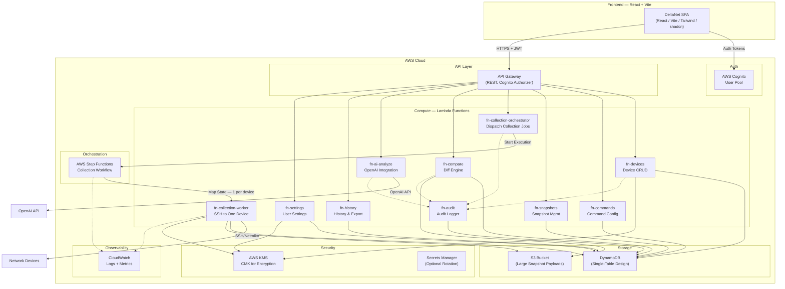
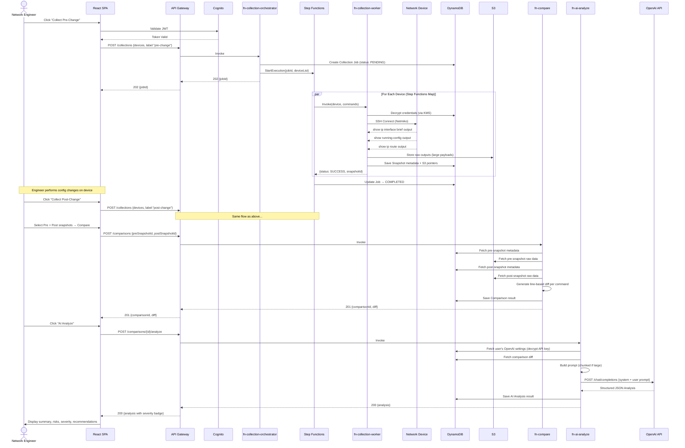
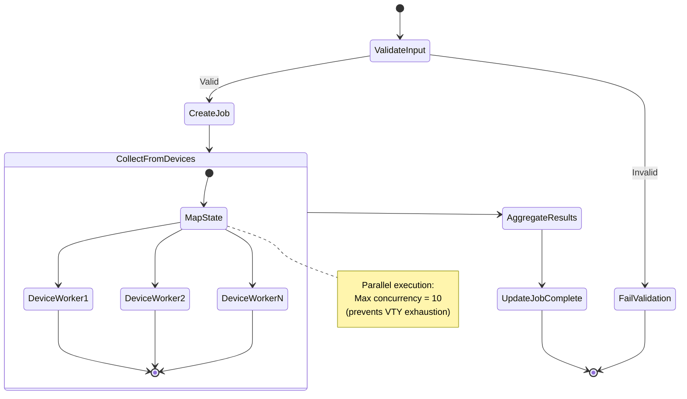

# DeltaNet — Network Automation & AI Analysis Platform

> **Implementation-Ready Development Plan**
> Build a desktop-first web application that collects "show" command outputs from Cisco network devices, stores timestamped snapshots, compares pre/post-change snapshots, and sends diffs to OpenAI for AI-powered severity analysis.

---

## 1. High-Level Architecture

### 1.1 Services & Data Flow



### 1.2 Collect → Compare → AI-Analyze Sequence Diagram



---

## 2. DynamoDB Data Model

### 2.1 Design Decision: Single-Table Design

**Recommendation: Single-table design.**

**Justification:**
- All entities (Users, Devices, Commands, Snapshots, Comparisons, Analyses, Audit Logs) share common access patterns anchored on `userId`.
- Reduces operational overhead (one table to manage, one set of capacity settings, one backup policy).
- Enables transactional writes across entity types (e.g., creating a device + default commands atomically).
- Per-user data isolation is enforced at the partition key level — a user can never accidentally query another user's data.

**Table Name:** `DeltaNet`

| Property | Value |
|---|---|
| Partition Key | `PK` (String) |
| Sort Key | `SK` (String) |
| Billing Mode | PAY_PER_REQUEST (on-demand) |
| Encryption | AWS-owned key (DynamoDB default) + field-level KMS encryption for secrets |
| TTL Attribute | `ttl` (for audit log expiration) |

### 2.2 Entity Key Schema

| Entity | PK | SK | Purpose |
|---|---|---|---|
| User Settings | `USER#<userId>` | `SETTINGS` | OpenAI config, preferences |
| Device | `USER#<userId>` | `DEVICE#<deviceId>` | Device inventory item |
| Command Set | `USER#<userId>` | `CMDSET#<setId>` | Global or per-device command set |
| Collection Job | `USER#<userId>` | `JOB#<jobId>` | Batch collection job metadata |
| Snapshot | `USER#<userId>` | `SNAP#<deviceId>#<timestamp>` | Per-device snapshot metadata |
| Comparison | `USER#<userId>` | `COMP#<comparisonId>` | Diff result metadata |
| AI Analysis | `USER#<userId>` | `ANALYSIS#<analysisId>` | OpenAI analysis result |
| Audit Log | `USER#<userId>` | `AUDIT#<timestamp>#<eventId>` | Audit trail entry |

### 2.3 GSI Definitions

| GSI Name | Partition Key | Sort Key | Purpose |
|---|---|---|---|
| `GSI1` | `GSI1PK` | `GSI1SK` | Query snapshots by device across users (admin); query jobs by status |
| `GSI2` | `GSI2PK` | `GSI2SK` | Query comparisons by device pair; query analyses by severity |

**GSI Key Mappings:**

| Entity | GSI1PK | GSI1SK | GSI2PK | GSI2SK |
|---|---|---|---|---|
| Device | `USER#<userId>#DEVICES` | `<deviceName>` | — | — |
| Collection Job | `USER#<userId>#JOBS` | `<status>#<timestamp>` | — | — |
| Snapshot | `USER#<userId>#SNAPS#<deviceId>` | `<timestamp>` | — | — |
| Comparison | `USER#<userId>#COMPS` | `<timestamp>` | `USER#<userId>#COMPS#<deviceId>` | `<timestamp>` |
| AI Analysis | `USER#<userId>#ANALYSES` | `<timestamp>` | `USER#<userId>#SEV` | `<severity>#<timestamp>` |

### 2.4 Example Items (JSON)

#### User Settings
```json
{
  "PK": "USER#u-abc123",
  "SK": "SETTINGS",
  "entityType": "UserSettings",
  "userId": "u-abc123",
  "email": "engineer@company.com",
  "openaiApiKeyEncrypted": "AQICAHh...base64...",
  "openaiModel": "gpt-4o",
  "openaiMaxTokens": 4096,
  "defaultCommandSetId": "cmdset-001",
  "createdAt": "2026-09-11T10:00:00Z",
  "updatedAt": "2026-09-11T10:00:00Z"
}
```

#### Device
```json
{
  "PK": "USER#u-abc123",
  "SK": "DEVICE#dev-001",
  "GSI1PK": "USER#u-abc123#DEVICES",
  "GSI1SK": "core-switch-01",
  "entityType": "Device",
  "userId": "u-abc123",
  "deviceId": "dev-001",
  "deviceName": "core-switch-01",
  "managementIp": "10.1.1.1",
  "sshPort": 22,
  "platform": "cisco_ios",
  "usernameEncrypted": "AQICAHh...base64...",
  "passwordEncrypted": "AQICAHh...base64...",
  "enableSecretEncrypted": "AQICAHh...base64...",
  "timeoutSeconds": 30,
  "tags": ["core", "datacenter-A"],
  "commandSetId": "cmdset-002",
  "createdAt": "2026-09-11T10:00:00Z",
  "updatedAt": "2026-09-11T10:00:00Z"
}
```

#### Command Set
```json
{
  "PK": "USER#u-abc123",
  "SK": "CMDSET#cmdset-001",
  "entityType": "CommandSet",
  "userId": "u-abc123",
  "setId": "cmdset-001",
  "name": "Standard IOS Collection",
  "isDefault": true,
  "commands": [
    "show running-config",
    "show ip interface brief",
    "show ip route",
    "show ip ospf neighbor",
    "show cdp neighbors detail",
    "show interfaces status",
    "show version"
  ],
  "createdAt": "2026-09-11T10:00:00Z",
  "updatedAt": "2026-09-11T10:00:00Z"
}
```

#### Collection Job
```json
{
  "PK": "USER#u-abc123",
  "SK": "JOB#job-550e",
  "GSI1PK": "USER#u-abc123#JOBS",
  "GSI1SK": "COMPLETED#2026-09-11T10:30:00Z",
  "entityType": "CollectionJob",
  "userId": "u-abc123",
  "jobId": "job-550e",
  "label": "pre-change",
  "changeLabel": "OSPF Area Restructure",
  "deviceIds": ["dev-001", "dev-002"],
  "status": "COMPLETED",
  "stepFunctionExecutionArn": "arn:aws:states:us-east-1:123456:execution:DeltaNetCollection:job-550e",
  "totalDevices": 2,
  "successCount": 2,
  "failureCount": 0,
  "startedAt": "2026-09-11T10:28:00Z",
  "completedAt": "2026-09-11T10:30:00Z",
  "deviceResults": {
    "dev-001": {"status": "SUCCESS", "snapshotId": "SNAP#dev-001#2026-09-11T10:29:15Z"},
    "dev-002": {"status": "SUCCESS", "snapshotId": "SNAP#dev-002#2026-09-11T10:29:22Z"}
  }
}
```

#### Snapshot
```json
{
  "PK": "USER#u-abc123",
  "SK": "SNAP#dev-001#2026-09-11T10:29:15Z",
  "GSI1PK": "USER#u-abc123#SNAPS#dev-001",
  "GSI1SK": "2026-09-11T10:29:15Z",
  "entityType": "Snapshot",
  "userId": "u-abc123",
  "deviceId": "dev-001",
  "deviceName": "core-switch-01",
  "jobId": "job-550e",
  "label": "pre-change",
  "changeLabel": "OSPF Area Restructure",
  "timestamp": "2026-09-11T10:29:15Z",
  "commandOutputs": {
    "show running-config": {"s3Key": "snapshots/u-abc123/dev-001/2026-09-11T10:29:15Z/show_running-config.txt", "sizeBytes": 45230, "lineCount": 892},
    "show ip interface brief": {"inline": "Interface   IP-Address  OK?  Method  Status  Protocol\nGi0/0       10.1.1.1    YES  manual  up      up\nGi0/1       10.1.2.1    YES  manual  up      up\nLo0         1.1.1.1     YES  manual  up      up", "sizeBytes": 210, "lineCount": 4},
    "show ip route": {"s3Key": "snapshots/u-abc123/dev-001/2026-09-11T10:29:15Z/show_ip_route.txt", "sizeBytes": 8420, "lineCount": 156}
  },
  "collectionDurationMs": 4500,
  "platform": "cisco_ios"
}
```

> [!NOTE]
> **Inline vs. S3 Storage Strategy:** Command outputs < 4 KB are stored inline in DynamoDB for fast retrieval. Outputs ≥ 4 KB are stored in S3 with a pointer (`s3Key`) in the DynamoDB item. This keeps DynamoDB item sizes under 400 KB while avoiding unnecessary S3 reads for small outputs.

#### Comparison
```json
{
  "PK": "USER#u-abc123",
  "SK": "COMP#comp-789",
  "GSI1PK": "USER#u-abc123#COMPS",
  "GSI1SK": "2026-09-11T11:00:00Z",
  "GSI2PK": "USER#u-abc123#COMPS#dev-001",
  "GSI2SK": "2026-09-11T11:00:00Z",
  "entityType": "Comparison",
  "userId": "u-abc123",
  "comparisonId": "comp-789",
  "deviceId": "dev-001",
  "deviceName": "core-switch-01",
  "preSnapshotSK": "SNAP#dev-001#2026-09-11T10:29:15Z",
  "postSnapshotSK": "SNAP#dev-001#2026-09-11T10:55:10Z",
  "preLabel": "pre-change",
  "postLabel": "post-change",
  "changeLabel": "OSPF Area Restructure",
  "diffSummary": {
    "totalCommands": 7,
    "commandsWithChanges": 3,
    "commandsIdentical": 4,
    "totalLinesAdded": 12,
    "totalLinesRemoved": 8,
    "totalLinesModified": 5
  },
  "diffs": {
    "show running-config": {"s3Key": "diffs/u-abc123/comp-789/show_running-config.diff.json", "hasChanges": true},
    "show ip interface brief": {"inline": {"added": [], "removed": [], "modified": [], "identical": true}, "hasChanges": false},
    "show ip route": {"s3Key": "diffs/u-abc123/comp-789/show_ip_route.diff.json", "hasChanges": true}
  },
  "analysisId": "analysis-456",
  "createdAt": "2026-09-11T11:00:00Z"
}
```

#### AI Analysis
```json
{
  "PK": "USER#u-abc123",
  "SK": "ANALYSIS#analysis-456",
  "GSI1PK": "USER#u-abc123#ANALYSES",
  "GSI1SK": "2026-09-11T11:02:00Z",
  "GSI2PK": "USER#u-abc123#SEV",
  "GSI2SK": "HIGH#2026-09-11T11:02:00Z",
  "entityType": "AIAnalysis",
  "userId": "u-abc123",
  "analysisId": "analysis-456",
  "comparisonId": "comp-789",
  "deviceId": "dev-001",
  "deviceName": "core-switch-01",
  "changeLabel": "OSPF Area Restructure",
  "model": "gpt-4o",
  "promptTokens": 3450,
  "completionTokens": 890,
  "totalTokens": 4340,
  "severity": "HIGH",
  "summary": "The OSPF area restructure moved interfaces Gi0/1 and Gi0/2 from Area 0 to Area 10, added a new stub area configuration, and modified route redistribution policies.",
  "impactAnalysis": "Traffic forwarding paths will change. OSPF SPF recalculation will occur across all affected areas. Adjacent routers must also be reconfigured for area boundary consistency.",
  "risks": [
    "Potential routing black-hole if adjacent router Area 10 configuration is not applied simultaneously",
    "OSPF adjacency flap during transition window",
    "Route redistribution change may advertise unexpected prefixes to BGP"
  ],
  "recommendations": [
    "Verify OSPF neighbor adjacency on all affected interfaces: show ip ospf neighbor",
    "Confirm route table convergence: show ip route ospf",
    "Schedule rollback window — apply change during maintenance",
    "Monitor for unexpected BGP route advertisements"
  ],
  "rawResponse": "{...full OpenAI response...}",
  "processingStrategy": "single-pass",
  "createdAt": "2026-09-11T11:02:00Z"
}
```

#### Audit Log
```json
{
  "PK": "USER#u-abc123",
  "SK": "AUDIT#2026-09-11T10:28:00Z#evt-001",
  "entityType": "AuditLog",
  "userId": "u-abc123",
  "eventId": "evt-001",
  "action": "COLLECTION_STARTED",
  "resourceType": "CollectionJob",
  "resourceId": "job-550e",
  "details": {"deviceCount": 2, "label": "pre-change"},
  "ipAddress": "203.0.113.50",
  "userAgent": "Mozilla/5.0...",
  "timestamp": "2026-09-11T10:28:00Z",
  "ttl": 1757545680
}
```

### 2.5 Access Patterns Summary

| # | Access Pattern | Operation | Key Condition |
|---|---|---|---|
| 1 | Get user settings | GetItem | `PK=USER#<userId>, SK=SETTINGS` |
| 2 | List all devices for user | Query | `PK=USER#<userId>, SK begins_with DEVICE#` |
| 3 | Get single device | GetItem | `PK=USER#<userId>, SK=DEVICE#<deviceId>` |
| 4 | List devices by name (sorted) | Query GSI1 | `GSI1PK=USER#<userId>#DEVICES` |
| 5 | List command sets for user | Query | `PK=USER#<userId>, SK begins_with CMDSET#` |
| 6 | List collection jobs (by status) | Query GSI1 | `GSI1PK=USER#<userId>#JOBS, GSI1SK begins_with <status>#` |
| 7 | Get all snapshots for a device (timeline) | Query GSI1 | `GSI1PK=USER#<userId>#SNAPS#<deviceId>` |
| 8 | Get latest snapshot for a device | Query GSI1 | Same as #7 + `ScanIndexForward=false, Limit=1` |
| 9 | List all comparisons for user | Query GSI1 | `GSI1PK=USER#<userId>#COMPS` |
| 10 | List comparisons for a specific device | Query GSI2 | `GSI2PK=USER#<userId>#COMPS#<deviceId>` |
| 11 | List analyses by severity | Query GSI2 | `GSI2PK=USER#<userId>#SEV, GSI2SK begins_with <severity>#` |
| 12 | Get audit trail (time range) | Query | `PK=USER#<userId>, SK between AUDIT#<start> and AUDIT#<end>` |

---

## 3. REST API Contract

### 3.1 Base URL & Auth

- **Base:** `https://{api-id}.execute-api.{region}.amazonaws.com/v1`
- **Auth:** All endpoints require `Authorization: Bearer <CognitoJWT>` header
- **Content-Type:** `application/json`

### 3.2 Endpoints

#### Authentication (handled by Cognito — no custom endpoints)

Cognito Hosted UI or Amplify handles sign-up, sign-in, MFA, password reset.

---

#### User Settings

| Method | Path | Description | Request Body | Response | Errors |
|---|---|---|---|---|---|
| `GET` | `/settings` | Get current user settings | — | `200 {openaiModel, openaiMaxTokens, defaultCommandSetId, hasApiKey}` | `401` |
| `PUT` | `/settings` | Update user settings | `{openaiApiKey?, openaiModel?, openaiMaxTokens?, defaultCommandSetId?}` | `200 {updated settings}` | `400, 401` |

> [!IMPORTANT]
> `GET /settings` returns `hasApiKey: true/false` — NEVER the actual key. The encrypted key is only decrypted server-side when calling OpenAI.

---

#### Devices

| Method | Path | Description | Request Body | Response | Errors |
|---|---|---|---|---|---|
| `GET` | `/devices` | List all devices | Query: `?tag=core&search=switch` | `200 {devices: [...], count}` | `401` |
| `POST` | `/devices` | Create a device | `{deviceName, managementIp, sshPort, platform, username, password, enableSecret?, timeoutSeconds?, tags?, commandSetId?}` | `201 {device}` | `400, 401, 409` |
| `GET` | `/devices/{deviceId}` | Get device details | — | `200 {device}` | `401, 404` |
| `PUT` | `/devices/{deviceId}` | Update a device | `{...partial device fields}` | `200 {device}` | `400, 401, 404` |
| `DELETE` | `/devices/{deviceId}` | Delete a device | — | `204` | `401, 404, 409` |
| `POST` | `/devices/{deviceId}/test` | Test SSH connectivity | — | `200 {reachable, responseTimeMs, error?}` | `401, 404` |

> [!NOTE]
> `409 Conflict` on DELETE if the device has active collection jobs. `409 Conflict` on POST if `managementIp + sshPort` already exists for this user.

---

#### Command Sets

| Method | Path | Description | Request Body | Response | Errors |
|---|---|---|---|---|---|
| `GET` | `/command-sets` | List command sets | — | `200 {commandSets: [...]}` | `401` |
| `POST` | `/command-sets` | Create command set | `{name, commands: [...], isDefault?}` | `201 {commandSet}` | `400, 401` |
| `GET` | `/command-sets/{setId}` | Get command set | — | `200 {commandSet}` | `401, 404` |
| `PUT` | `/command-sets/{setId}` | Update command set | `{name?, commands?, isDefault?}` | `200 {commandSet}` | `400, 401, 404` |
| `DELETE` | `/command-sets/{setId}` | Delete command set | — | `204` | `401, 404, 409` |

**Command Validation Rules (enforced on POST/PUT):**
- Commands MUST start with `show` (case-insensitive)
- Reject any command containing `configure`, `conf t`, `no `, `enable`, `reload`, `write`, `copy`, `delete`, `erase`
- Maximum 20 commands per set
- No duplicate commands within a set

---

#### Collections

| Method | Path | Description | Request Body | Response | Errors |
|---|---|---|---|---|---|
| `POST` | `/collections` | Start a collection job | `{deviceIds: [...], label: "pre-change"\|"post-change", changeLabel?: "OSPF migration"}` | `202 {jobId, status: "PENDING"}` | `400, 401` |
| `GET` | `/collections` | List collection jobs | Query: `?status=COMPLETED&limit=20` | `200 {jobs: [...], nextToken?}` | `401` |
| `GET` | `/collections/{jobId}` | Get job status & results | — | `200 {job with deviceResults}` | `401, 404` |
| `DELETE` | `/collections/{jobId}` | Cancel a running job | — | `200 {status: "CANCELLED"}` | `401, 404, 409` |

**Response for `GET /collections/{jobId}`:**
```json
{
  "jobId": "job-550e",
  "label": "pre-change",
  "changeLabel": "OSPF Area Restructure",
  "status": "IN_PROGRESS",
  "totalDevices": 5,
  "successCount": 3,
  "failureCount": 1,
  "pendingCount": 1,
  "deviceResults": {
    "dev-001": {"status": "SUCCESS", "snapshotId": "snap-xxx", "durationMs": 4500},
    "dev-002": {"status": "SUCCESS", "snapshotId": "snap-yyy", "durationMs": 3200},
    "dev-003": {"status": "FAILED", "error": "Connection timed out after 30s", "durationMs": 30000},
    "dev-004": {"status": "SUCCESS", "snapshotId": "snap-zzz", "durationMs": 5100},
    "dev-005": {"status": "IN_PROGRESS"}
  },
  "startedAt": "2026-09-11T10:28:00Z"
}
```

---

#### Snapshots

| Method | Path | Description | Request Body | Response | Errors |
|---|---|---|---|---|---|
| `GET` | `/snapshots` | List snapshots | Query: `?deviceId=dev-001&label=pre-change&limit=20` | `200 {snapshots: [...], nextToken?}` | `401` |
| `GET` | `/snapshots/{snapshotSK}` | Get snapshot with command outputs | — | `200 {snapshot, commandOutputs}` | `401, 404` |
| `DELETE` | `/snapshots/{snapshotSK}` | Delete a snapshot | — | `204` | `401, 404, 409` |

---

#### Comparisons

| Method | Path | Description | Request Body | Response | Errors |
|---|---|---|---|---|---|
| `POST` | `/comparisons` | Create a comparison | `{preSnapshotSK, postSnapshotSK}` | `201 {comparison with diffs}` | `400, 401, 404` |
| `GET` | `/comparisons` | List comparisons | Query: `?deviceId=dev-001&limit=20` | `200 {comparisons: [...], nextToken?}` | `401` |
| `GET` | `/comparisons/{comparisonId}` | Get comparison with full diffs | — | `200 {comparison, diffs}` | `401, 404` |
| `DELETE` | `/comparisons/{comparisonId}` | Delete comparison | — | `204` | `401, 404` |
| `POST` | `/comparisons/{comparisonId}/analyze` | Trigger AI analysis | — | `200 {analysis}` | `400, 401, 404, 424, 502` |

**Error Codes for AI Analysis:**
- `400` — Snapshots are identical (no diff to analyze)
- `424 Failed Dependency` — No OpenAI API key configured
- `502 Bad Gateway` — OpenAI API call failed (includes error message)

---

#### History & Export

| Method | Path | Description | Request Body | Response | Errors |
|---|---|---|---|---|---|
| `GET` | `/history` | Unified timeline | Query: `?deviceId=dev-001&from=&to=&type=snapshot\|comparison\|analysis` | `200 {events: [...], nextToken?}` | `401` |
| `GET` | `/export/comparison/{comparisonId}` | Export comparison as JSON | — | `200 {full JSON export}` | `401, 404` |
| `GET` | `/export/analysis/{analysisId}` | Export analysis as JSON | — | `200 {full JSON export}` | `401, 404` |

---

#### Audit Logs

| Method | Path | Description | Request Body | Response | Errors |
|---|---|---|---|---|---|
| `GET` | `/audit-logs` | Query audit trail | Query: `?from=&to=&action=COLLECTION_STARTED&limit=50` | `200 {logs: [...], nextToken?}` | `401` |

---

## 4. Lambda Function Breakdown

### 4.1 Function Inventory

| Function Name | Responsibility | Trigger | Timeout | Memory | Notes |
|---|---|---|---|---|---|
| `fn-devices` | Device CRUD, test connectivity | API Gateway | 30s (test: 60s) | 256 MB | KMS decrypt for test-connect |
| `fn-commands` | Command set CRUD, validation | API Gateway | 10s | 128 MB | Lightweight validation logic |
| `fn-settings` | User settings CRUD, encrypt API key | API Gateway | 10s | 128 MB | KMS encrypt/decrypt |
| `fn-collection-orchestrator` | Validate devices, create job, start Step Functions | API Gateway | 15s | 256 MB | Returns immediately with `202` |
| `fn-collection-worker` | SSH into ONE device, run commands, save snapshot | Step Functions (Map state) | **5 min** | 512 MB | Netmiko layer; KMS decrypt credentials |
| `fn-compare` | Fetch 2 snapshots, generate diff | API Gateway | 60s | 512 MB | May read large configs from S3 |
| `fn-ai-analyze` | Build prompt, call OpenAI, parse response | API Gateway | 120s | 256 MB | OpenAI API can be slow; chunking logic |
| `fn-history` | Query timeline, export data | API Gateway | 15s | 128 MB | Read-only queries |
| `fn-audit` | Write audit log entries | Async invocation (from other Lambdas) | 10s | 128 MB | Fire-and-forget from callers |

### 4.2 Long-Running Collection Strategy

> [!IMPORTANT]
> **Why Step Functions instead of in-Lambda threading:**
> 
> The user requirement calls for Threading inside Lambda. However, threading inside a single Lambda invocation creates critical issues:
> 1. **15-minute hard ceiling** — if 20 devices each take 60s, threading helps but doesn't solve the problem for large device batches.
> 2. **Error isolation** — one hung thread can consume resources, and thread-level exception handling in Python is fragile.
> 3. **No visibility** — you can't see per-device progress from outside the Lambda.
> 
> **Solution: Step Functions with Map State** provides native parallelism with per-device error isolation.



**Map State Configuration:**
- `MaxConcurrency: 10` — prevents overwhelming network devices (VTY line exhaustion)
- Each iteration invokes `fn-collection-worker` for a single device
- Individual failures are caught and recorded — they do NOT abort the entire Map
- `ErrorEquals: ["States.ALL"]` with `ResultPath: "$.error"` per iteration

### 4.3 Lambda Layer

**`netmiko-layer`** — Shared Lambda Layer containing:
- `netmiko` (and dependencies: `paramiko`, `cryptography`, `bcrypt`, `PyNaCl`)
- Built on Amazon Linux 2023 (Python 3.12 compatible)
- Estimated size: ~40 MB compressed

**Build process:**
```bash
# In AWS CloudShell or Amazon Linux Docker
mkdir -p python
pip install netmiko -t python/
zip -r netmiko-layer.zip python/
aws lambda publish-layer-version \
  --layer-name deltanet-netmiko \
  --zip-file fileb://netmiko-layer.zip \
  --compatible-runtimes python3.12
```

---

## 5. Backend Project Folder Structure

```
backend/
├── template.yaml                    # SAM/CloudFormation template (infra-as-code)
├── samconfig.toml                   # SAM deployment config
├── requirements/
│   ├── base.txt                     # Shared dependencies (boto3, pydantic)
│   ├── worker.txt                   # Netmiko-specific deps (for layer building)
│   └── dev.txt                      # pytest, moto, black, ruff
├── layers/
│   └── netmiko/
│       └── build.sh                 # Script to build Netmiko Lambda layer
├── shared/                          # Shared Python package (Lambda layer or bundled)
│   ├── __init__.py
│   ├── models.py                    # Pydantic models for all DynamoDB entities
│   ├── dynamo.py                    # DynamoDB client wrapper with single-table helpers
│   ├── s3.py                        # S3 read/write helpers for large payloads
│   ├── kms.py                       # KMS encrypt/decrypt utility functions
│   ├── auth.py                      # Extract userId from Cognito JWT claims
│   ├── response.py                  # Standardized API Gateway response builders
│   ├── validators.py                # Input validation (command safety, IP format, etc.)
│   ├── exceptions.py                # Custom exception hierarchy
│   ├── audit.py                     # Async audit log writer (invokes fn-audit)
│   └── constants.py                 # Table name, S3 bucket, KMS key ARN, etc.
├── functions/
│   ├── devices/
│   │   ├── __init__.py
│   │   ├── handler.py               # Lambda entry point — routes CRUD + test-connect
│   │   └── service.py               # Device business logic (create, update, delete, test)
│   ├── commands/
│   │   ├── __init__.py
│   │   ├── handler.py               # Lambda entry point — routes command set CRUD
│   │   └── service.py               # Command set logic + safety validation
│   ├── settings/
│   │   ├── __init__.py
│   │   ├── handler.py               # Lambda entry point — user settings CRUD
│   │   └── service.py               # Settings logic + API key encryption
│   ├── collection_orchestrator/
│   │   ├── __init__.py
│   │   ├── handler.py               # Lambda entry point — creates job, starts Step Functions
│   │   └── service.py               # Job creation, device validation, SFN start
│   ├── collection_worker/
│   │   ├── __init__.py
│   │   ├── handler.py               # Lambda entry point — collects from ONE device
│   │   ├── service.py               # SSH connection + command execution logic
│   │   └── netmiko_wrapper.py       # Netmiko ConnectHandler wrapper with timeout/retry
│   ├── compare/
│   │   ├── __init__.py
│   │   ├── handler.py               # Lambda entry point — generates diff
│   │   ├── service.py               # Comparison orchestration
│   │   ├── differ.py                # Line-based diff engine with normalization
│   │   └── normalizer.py            # Whitespace normalization, table output parsing
│   ├── ai_analyze/
│   │   ├── __init__.py
│   │   ├── handler.py               # Lambda entry point — OpenAI analysis
│   │   ├── service.py               # Analysis orchestration + chunking strategy
│   │   ├── prompt_builder.py        # Prompt template construction
│   │   └── openai_client.py         # OpenAI API client wrapper with retry/error handling
│   ├── history/
│   │   ├── __init__.py
│   │   ├── handler.py               # Lambda entry point — timeline + export
│   │   └── service.py               # History query + JSON export builder
│   └── audit/
│       ├── __init__.py
│       ├── handler.py               # Lambda entry point — write audit log
│       └── service.py               # Audit log writer
├── state_machines/
│   └── collection_workflow.asl.json # Step Functions ASL definition
└── tests/
    ├── conftest.py                  # Shared fixtures (mocked DDB, S3, KMS)
    ├── test_devices.py
    ├── test_commands.py
    ├── test_collection_worker.py
    ├── test_compare.py
    ├── test_ai_analyze.py
    └── test_integration.py          # End-to-end with moto mocks
```

---

## 6. Frontend Plan

### 6.1 Routes & Pages

| Route | Page | Description |
|---|---|---|
| `/login` | LoginPage | Cognito hosted UI redirect or Amplify `<Authenticator>` |
| `/` | DashboardPage | Overview: recent jobs, device count, latest analyses, severity distribution |
| `/devices` | DevicesPage | Device inventory table with search, filter, CRUD |
| `/devices/new` | DeviceFormPage | Create new device form |
| `/devices/:id` | DeviceDetailPage | Device info, snapshot timeline, connection test |
| `/devices/:id/edit` | DeviceFormPage | Edit device form (reuses create form) |
| `/commands` | CommandSetsPage | List command sets, create/edit/delete |
| `/commands/new` | CommandSetFormPage | Create command set with validation |
| `/commands/:id/edit` | CommandSetFormPage | Edit command set |
| `/collect` | CollectPage | Select devices, choose label, trigger collection |
| `/collections` | CollectionsPage | List of collection jobs with status badges |
| `/collections/:jobId` | CollectionDetailPage | Job progress, per-device status, link to snapshots |
| `/compare` | ComparePage | Select pre/post snapshots → generate diff |
| `/comparisons/:id` | ComparisonDetailPage | Side-by-side diff viewer + AI analysis trigger/results |
| `/history` | HistoryPage | Unified timeline with filters |
| `/settings` | SettingsPage | OpenAI API key, model selection, default command set |
| `/audit` | AuditLogPage | Audit trail table with filters |

### 6.2 Component Hierarchy

```
App
├── AuthProvider (Amplify)
│   ├── Layout
│   │   ├── Sidebar
│   │   │   ├── Logo
│   │   │   ├── NavLinks
│   │   │   └── UserMenu (sign out, settings)
│   │   ├── TopBar
│   │   │   ├── Breadcrumbs
│   │   │   └── NotificationBell (job completion toasts)
│   │   └── MainContent
│   │       ├── DashboardPage
│   │       │   ├── StatsCards (device count, snapshots, analyses)
│   │       │   ├── RecentJobsTable
│   │       │   ├── SeverityDistributionChart
│   │       │   └── LatestAnalysesList
│   │       ├── DevicesPage
│   │       │   ├── DeviceSearchBar
│   │       │   ├── DeviceTagFilter
│   │       │   ├── DeviceDataTable (sortable, paginated)
│   │       │   └── DeviceFormDialog
│   │       ├── CollectPage
│   │       │   ├── DeviceSelector (multi-select with checkboxes)
│   │       │   ├── LabelSelector (pre-change / post-change)
│   │       │   ├── ChangeLabelInput
│   │       │   └── CollectionProgressTracker
│   │       ├── ComparePage
│   │       │   ├── SnapshotPicker (device → snapshot timeline)
│   │       │   └── CompareButton
│   │       ├── ComparisonDetailPage
│   │       │   ├── DiffViewer
│   │       │   │   ├── CommandTabs
│   │       │   │   ├── SplitDiffPane (side-by-side)
│   │       │   │   ├── UnifiedDiffPane
│   │       │   │   └── DiffStats
│   │       │   ├── AIAnalysisPanel
│   │       │   │   ├── SeverityBadge
│   │       │   │   ├── SummarySection
│   │       │   │   ├── ImpactSection
│   │       │   │   ├── RisksList
│   │       │   │   └── RecommendationsList
│   │       │   └── AnalyzeButton
│   │       ├── HistoryPage
│   │       │   ├── TimelineFilter
│   │       │   └── TimelineList
│   │       ├── SettingsPage
│   │       │   ├── OpenAIConfigForm
│   │       │   └── DefaultsForm
│   │       └── AuditLogPage
│   │           ├── AuditFilters
│   │           └── AuditLogTable
│   └── Toaster (global notifications)
```

### 6.3 State Management

**Approach: TanStack Query (React Query) + Zustand**

| Concern | Tool | Rationale |
|---|---|---|
| Server state (API data) | **TanStack Query v5** | Automatic caching, refetching, pagination, optimistic updates, polling for job status |
| Client UI state | **Zustand** | Lightweight global state for sidebar collapse, selected devices, diff view mode, theme |
| Form state | **React Hook Form + Zod** | Schema-based validation, handles complex forms (device with credentials) |
| Auth state | **Amplify Auth** | Token management, session persistence, auto-refresh |

**Polling Strategy for Collection Jobs:**
```typescript
// Poll job status every 3s while IN_PROGRESS
const { data: job } = useQuery({
  queryKey: ['collection', jobId],
  queryFn: () => api.getCollectionJob(jobId),
  refetchInterval: (query) => 
    query.state.data?.status === 'IN_PROGRESS' ? 3000 : false,
});
```

### 6.4 Key shadcn/ui Components Per Screen

| Screen | shadcn/ui Components |
|---|---|
| **All Pages** | `Button`, `Tooltip`, `Badge`, `Skeleton`, `Sheet` (sidebar), `Breadcrumb`, `Sonner` (toasts) |
| **Dashboard** | `Card`, `Table`, `Tabs` |
| **Devices** | `DataTable`, `Dialog`, `Input`, `Select`, `DropdownMenu`, `AlertDialog` (delete confirm) |
| **Device Form** | `Form`, `Input`, `Select`, `Switch`, `Separator`, `Label` |
| **Collect** | `Checkbox`, `RadioGroup`, `Progress`, `Alert`, `Input` |
| **Compare** | `Select`, `ScrollArea`, `Tabs`, `Separator` |
| **Comparison Detail** | `Tabs`, `ScrollArea`, `Badge`, `Card`, `Accordion`, `Collapsible` |
| **Settings** | `Form`, `Input`, `Select`, `Switch`, `Separator` |
| **Audit Log** | `DataTable`, `DatePicker`, `Select` |
| **Diff Viewer** | Custom component using `react-diff-viewer-continued` styled with Tailwind |

---

## 7. AI Prompt Template & Token Strategy

### 7.1 System Prompt

```
You are a senior network engineer and configuration auditor. You are analyzing 
the output of Cisco "show" commands collected from a network device before and 
after a configuration change.

Your task is to analyze the diff (comparison) between the pre-change and 
post-change outputs and provide a structured assessment.

Rules:
1. Focus ONLY on functional, operational changes. Ignore cosmetic differences 
   (whitespace, line ordering that doesn't affect behavior, timestamp changes 
   in uptime counters).
2. Assess the severity of the change based on its potential impact to network 
   availability, traffic forwarding, security posture, and protocol stability.
3. Be specific — reference exact interface names, IP addresses, route entries, 
   OSPF areas, ACL names, etc. from the diff.
4. If the diff is empty or shows no meaningful changes, state that explicitly.

Severity Definitions:
- CRITICAL: Change could cause immediate network outage, routing loop, or 
  security breach (e.g., removing the last default route, disabling a trunk port).
- HIGH: Change significantly alters traffic flow or protocol behavior and 
  requires coordinated action (e.g., OSPF area restructure, major ACL changes).
- MEDIUM: Change modifies specific features with contained blast radius 
  (e.g., adding a new VLAN, adjusting OSPF timers on a non-critical link).
- LOW: Minor operational change with minimal risk (e.g., updating a description, 
  adding a loopback interface, NTP server change).
- INFORMATIONAL: No functional change detected, or change is purely cosmetic 
  (e.g., banner update, comment changes).

You MUST respond with valid JSON matching the provided schema. Do not include 
any text outside the JSON object.
```

### 7.2 User Prompt Template

```
## Device Information
- Device Name: {device_name}
- Platform: {platform}
- Management IP: {management_ip}
- Change Label: {change_label}
- Pre-Change Timestamp: {pre_timestamp}
- Post-Change Timestamp: {post_timestamp}

## Diff Output

{for each command with changes}
### Command: {command_name}
```diff
{unified_diff_output}
```
{end for}

## Commands With No Changes
{list of commands that were identical}

Analyze the above diff and provide your assessment as JSON.
```

### 7.3 Structured JSON Response Schema

```json
{
  "$schema": "http://json-schema.org/draft-07/schema#",
  "type": "object",
  "required": ["severity", "summary", "impactAnalysis", "risks", "recommendations"],
  "properties": {
    "severity": {
      "type": "string",
      "enum": ["CRITICAL", "HIGH", "MEDIUM", "LOW", "INFORMATIONAL"]
    },
    "summary": {
      "type": "string",
      "description": "2-4 sentence plain-language summary of what changed"
    },
    "impactAnalysis": {
      "type": "string",
      "description": "Detailed analysis of how these changes affect network behavior, traffic forwarding, and protocol operations"
    },
    "risks": {
      "type": "array",
      "items": {"type": "string"},
      "description": "List of potential risks or unintended consequences"
    },
    "recommendations": {
      "type": "array",
      "items": {"type": "string"},
      "description": "Specific follow-up actions the engineer should take to verify the change"
    },
    "commandBreakdown": {
      "type": "array",
      "items": {
        "type": "object",
        "properties": {
          "command": {"type": "string"},
          "changeType": {"type": "string", "enum": ["added", "removed", "modified", "unchanged"]},
          "details": {"type": "string"}
        }
      },
      "description": "Per-command breakdown of changes detected"
    }
  },
  "additionalProperties": false
}
```

### 7.4 Large Diff Token Strategy

| Scenario | Strategy | Implementation |
|---|---|---|
| **Total diff < 8K tokens** | Single-pass analysis | Send full diff in one API call |
| **Total diff 8K–32K tokens** | Per-command analysis | Analyze each command's diff separately, then synthesize |
| **Total diff > 32K tokens** | Chunked + synthesize | Split large command diffs into chunks, analyze each, then run a final synthesis pass |
| **Single command > 32K tokens** | Truncate with summary | Send first/last 4K tokens with a note about truncation; flag as requiring manual review |

**Implementation (in `fn-ai-analyze/service.py`):**
```python
import tiktoken

def estimate_tokens(text: str, model: str = "gpt-4o") -> int:
    enc = tiktoken.encoding_for_model(model)
    return len(enc.encode(text))

def build_analysis_strategy(diffs: dict, model: str) -> str:
    total_tokens = sum(estimate_tokens(d) for d in diffs.values())
    
    if total_tokens < 8000:
        return "single-pass"
    elif total_tokens < 32000:
        return "per-command"
    else:
        return "chunked"
```

**Per-Command Strategy Flow:**
1. Analyze each command diff individually → get per-command severity + findings
2. Build a synthesis prompt with all per-command results
3. Ask the model for an overall severity + consolidated analysis
4. Return the synthesized result with per-command breakdown

---

## 8. User Stories with Acceptance Criteria

### Epic 1: Authentication & Onboarding

#### US-1.1: User Registration
> **As a** network engineer, **I want to** create an account, **so that** I can access the application securely.

**Acceptance Criteria:**
- [ ] User can sign up with email and password via Cognito
- [ ] Email verification is required before first login
- [ ] Password policy: min 12 chars, 1 uppercase, 1 lowercase, 1 number, 1 special char
- [ ] After first login, user is directed to Settings to configure OpenAI API key

#### US-1.2: User Login
> **As a** registered user, **I want to** sign in with my credentials, **so that** I can access my devices and data.

**Acceptance Criteria:**
- [ ] JWT tokens are stored securely (httpOnly not applicable to SPA — use Amplify's default secure storage)
- [ ] Session persists across browser refreshes
- [ ] Token auto-refresh before expiration
- [ ] Unauthorized API calls redirect to login

#### US-1.3: User Sign-Out
> **As a** user, **I want to** sign out, **so that** my session is terminated.

**Acceptance Criteria:**
- [ ] All tokens are cleared
- [ ] Redirect to login page

---

### Epic 2: Device Management

#### US-2.1: Add a Network Device
> **As a** network engineer, **I want to** add a device with its SSH credentials, **so that** I can collect data from it later.

**Acceptance Criteria:**
- [ ] Form validates: device name (unique per user), IP format, port range (1-65535), platform from dropdown
- [ ] Credentials are encrypted with KMS before storage
- [ ] `409 Conflict` if IP:port already exists for this user
- [ ] Device appears in inventory immediately after creation

#### US-2.2: List and Search Devices
> **As a** user, **I want to** view all my devices and search/filter them, **so that** I can find specific devices quickly.

**Acceptance Criteria:**
- [ ] Devices displayed in a sortable, paginated data table
- [ ] Search by name or IP
- [ ] Filter by tags
- [ ] Only the current user's devices are visible (per-user isolation)

#### US-2.3: Test Device Connectivity
> **As a** user, **I want to** test SSH connectivity to a device, **so that** I can verify credentials before a real collection.

**Acceptance Criteria:**
- [ ] Button on device detail page triggers connectivity test
- [ ] Success shows response time; failure shows specific error (timeout, auth failed, unreachable)
- [ ] Test does NOT run any show commands — only verifies SSH handshake

#### US-2.4: Edit/Delete a Device
> **As a** user, **I want to** update device details or remove a device, **so that** I can keep my inventory current.

**Acceptance Criteria:**
- [ ] Edit form pre-populates all fields (credentials show masked placeholders)
- [ ] Credentials only update if new values are provided
- [ ] Delete requires confirmation dialog
- [ ] Cannot delete device with active collection job (409)
- [ ] Deleting a device does NOT delete its historical snapshots

---

### Epic 3: Command Configuration

#### US-3.1: Create a Command Set
> **As a** user, **I want to** define a set of show commands, **so that** I can reuse them across collections.

**Acceptance Criteria:**
- [ ] Commands validated to start with "show" (case-insensitive)
- [ ] Blocked commands rejected with clear error message
- [ ] Max 20 commands per set
- [ ] One set can be marked as default

#### US-3.2: Assign Command Set to Device
> **As a** user, **I want to** override the default command set for specific devices, **so that** I can collect device-specific data.

**Acceptance Criteria:**
- [ ] Device form has optional command set selector
- [ ] If no override, device uses the user's default command set
- [ ] Collection uses device-specific set if assigned, else falls back to default

---

### Epic 4: Snapshot Collection

#### US-4.1: Trigger Pre-Change Collection
> **As a** user, **I want to** select devices and trigger a pre-change collection, **so that** I capture the baseline state.

**Acceptance Criteria:**
- [ ] Multi-select device picker with "Select All" / tag-based selection
- [ ] Label required: "pre-change" or "post-change"
- [ ] Optional change label (free text, e.g., "OSPF migration")
- [ ] Returns immediately with `202` and a job ID
- [ ] UI shows real-time progress (polling every 3s)

#### US-4.2: Monitor Collection Progress
> **As a** user, **I want to** see per-device collection status in real time, **so that** I know which devices succeeded or failed.

**Acceptance Criteria:**
- [ ] Progress bar showing X/N devices completed
- [ ] Per-device status: pending / in-progress / success / failed
- [ ] Failed devices show error message (connection timeout, auth error, command error)
- [ ] One failed device does NOT affect other devices in the batch
- [ ] Job marked COMPLETED when all devices finish (success or failure)

#### US-4.3: Trigger Post-Change Collection
> **As a** user, **I want to** trigger a post-change collection after making network changes, **so that** I capture the new state.

**Acceptance Criteria:**
- [ ] Same flow as pre-change, but label = "post-change"
- [ ] UI suggests the same devices and change label from the last pre-change collection

---

### Epic 5: Comparison & Diff

#### US-5.1: Compare Two Snapshots
> **As a** user, **I want to** select a pre-change and post-change snapshot for the same device and generate a diff, **so that** I can see exactly what changed.

**Acceptance Criteria:**
- [ ] Snapshot picker shows timeline per device with label badges
- [ ] Diff generated per command
- [ ] Side-by-side (split) and unified diff views available
- [ ] Added lines highlighted green, removed lines highlighted red
- [ ] Whitespace-normalized comparison available as toggle
- [ ] If snapshots are identical, a clear "No Changes Detected" message is shown

#### US-5.2: View Diff Detail
> **As a** user, **I want to** navigate diffs per command using tabs, **so that** I can focus on specific areas of change.

**Acceptance Criteria:**
- [ ] Tab for each command; badge showing change count per tab
- [ ] Commands with no changes shown but visually de-emphasized
- [ ] Diff stats summary: lines added, removed, modified per command
- [ ] Scrollable diff panels for large outputs

---

### Epic 6: AI Analysis

#### US-6.1: Trigger AI Analysis
> **As a** user, **I want to** send a comparison diff to OpenAI for analysis, **so that** I get expert-level interpretation of the changes.

**Acceptance Criteria:**
- [ ] "Analyze with AI" button on comparison detail page
- [ ] Loading state shows "Analyzing... (this may take up to 60s)"
- [ ] If no API key configured → show actionable error with link to Settings
- [ ] If OpenAI returns error → show error details + suggest retry
- [ ] If snapshots identical → block analysis with "No changes to analyze"

#### US-6.2: View AI Analysis Results
> **As a** user, **I want to** see the AI analysis with severity, summary, risks, and recommendations, **so that** I can make informed decisions.

**Acceptance Criteria:**
- [ ] Severity badge: Critical (red), High (orange), Medium (yellow), Low (blue), Informational (gray)
- [ ] Summary in plain language
- [ ] Impact analysis paragraph
- [ ] Risks as a numbered list with icons
- [ ] Recommendations as actionable checklist
- [ ] Per-command breakdown in collapsible section
- [ ] Model used and token count shown in footer

#### US-6.3: Re-run Analysis
> **As a** user, **I want to** re-run AI analysis on the same comparison, **so that** I can get updated analysis after changing model settings.

**Acceptance Criteria:**
- [ ] "Re-analyze" button available on existing analysis
- [ ] New analysis replaces the old one (old one is NOT preserved)
- [ ] Uses current model settings from user's Settings

---

### Epic 7: History & Reporting

#### US-7.1: View Device History
> **As a** user, **I want to** see a timeline of all snapshots, comparisons, and analyses for a device, **so that** I can track changes over time.

**Acceptance Criteria:**
- [ ] Timeline shows events chronologically
- [ ] Each event links to its detail page
- [ ] Filter by event type and date range

#### US-7.2: Export Data
> **As a** user, **I want to** export comparison and analysis results as JSON, **so that** I can share them or archive them externally.

**Acceptance Criteria:**
- [ ] "Export JSON" button on comparison and analysis detail pages
- [ ] Downloaded file includes full diff + analysis + metadata
- [ ] Filename includes device name and timestamps

---

### Epic 8: Settings & Configuration

#### US-8.1: Configure OpenAI Settings
> **As a** user, **I want to** enter my OpenAI API key and select a model, **so that** the app can perform AI analysis.

**Acceptance Criteria:**
- [ ] API key input masked (password field); shows "Key configured ✓" after saving
- [ ] Model selector dropdown: gpt-4o, gpt-4o-mini, gpt-4-turbo, gpt-3.5-turbo
- [ ] "Test API Key" button validates the key against OpenAI
- [ ] Key encrypted with KMS before storage; NEVER returned in GET response

#### US-8.2: View Audit Log
> **As a** user, **I want to** see a log of my actions, **so that** I can review what happened and when.

**Acceptance Criteria:**
- [ ] Table with: timestamp, action, resource, details
- [ ] Filterable by action type and date range
- [ ] Sortable by timestamp
- [ ] Audit logs have a 90-day TTL

---

## 9. Phased Development Roadmap

### Phase 1: MVP (Estimated: 6–8 weeks)

**Goal:** Core collect → compare → analyze loop working end-to-end.

| Week | Deliverable | Effort |
|---|---|---|
| 1 | Project scaffolding: Vite + React + Tailwind + shadcn/ui setup; SAM backend template; DynamoDB table; Cognito User Pool | 3 days |
| 1–2 | Auth integration (Amplify on frontend, Cognito authorizer on API GW) | 3 days |
| 2–3 | Device CRUD (backend Lambda + API + frontend pages) | 4 days |
| 3 | Command Set CRUD (backend + frontend) | 2 days |
| 3–4 | User Settings with KMS encryption (backend + frontend) | 2 days |
| 4–5 | Collection engine: orchestrator + Step Functions + worker Lambda + Netmiko layer | 5 days |
| 5–6 | Snapshot storage (DynamoDB + S3) + snapshot list/detail UI | 3 days |
| 6–7 | Comparison engine (differ + normalizer) + diff viewer UI | 5 days |
| 7–8 | AI analysis module (prompt builder + OpenAI client) + analysis display UI | 4 days |
| 8 | Integration testing, bug fixes, polish | 3 days |

**MVP Deliverables:**
- ✅ User auth (sign up, login, logout)
- ✅ Device CRUD with encrypted credentials
- ✅ Command set management with safety validation
- ✅ Pre/post collection via Step Functions
- ✅ Snapshot viewing
- ✅ Side-by-side diff viewer
- ✅ AI analysis with severity rating
- ✅ Basic settings page

---

### Phase 2: v1.0 (Estimated: 4–5 weeks)

**Goal:** Production-ready with history, audit, and polish.

| Week | Deliverable | Effort |
|---|---|---|
| 9 | History page + unified timeline | 3 days |
| 9–10 | Audit logging (backend + UI) | 3 days |
| 10 | JSON export for comparisons and analyses | 2 days |
| 10–11 | Dashboard page with stats, recent activity, severity chart | 3 days |
| 11 | Collection job cancellation + retry failed devices | 2 days |
| 11–12 | Large diff chunking strategy for AI analysis | 3 days |
| 12 | Device connectivity test | 1 day |
| 12–13 | End-to-end testing, security audit, performance optimization | 5 days |

**v1.0 Deliverables (in addition to MVP):**
- ✅ Full history timeline
- ✅ Audit trail with 90-day TTL
- ✅ JSON export
- ✅ Dashboard with analytics
- ✅ Job cancellation
- ✅ Large diff handling
- ✅ Security hardening

---

### Phase 3: Enhancements (Estimated: 4–6 weeks)

**Goal:** Power-user features and operational excellence.

| Feature | Effort | Priority |
|---|---|---|
| Scheduled collections (EventBridge cron → Step Functions) | 3 days | High |
| Diff annotations/comments (user can annotate diff lines) | 3 days | Medium |
| Multi-device comparison view (compare same command across devices) | 4 days | Medium |
| PDF report generation (comparison + analysis → PDF) | 3 days | Medium |
| Team/organization support (shared device inventory, RBAC) | 5 days | Low |
| Webhook notifications (Slack/Teams integration for completed analyses) | 2 days | Low |
| Config compliance checking (golden config diff baseline) | 4 days | Low |
| Dark mode toggle | 1 day | Low |
| Device group management (logical groupings beyond tags) | 2 days | Low |

---

## 10. Security Checklist, Edge Cases, Risks & Mitigations

### 10.1 Security Checklist

| # | Control | Implementation |
|---|---|---|
| 1 | **Secrets at rest** | Device credentials + OpenAI API key encrypted with KMS CMK before DynamoDB write |
| 2 | **Secrets in transit** | All API calls over HTTPS (API Gateway enforced); Cognito token exchange over HTTPS |
| 3 | **No secrets in responses** | API NEVER returns `*Encrypted` fields; returns `hasApiKey: true/false` and masked placeholders |
| 4 | **Per-user data isolation** | Every DynamoDB query uses `PK=USER#<userId>` from the authenticated JWT `sub` claim. No cross-user access is possible |
| 5 | **Command injection prevention** | Commands validated server-side: MUST start with `show`, blocklist enforced. Netmiko's `send_command()` used (NOT `send_command_timing` with arbitrary input) |
| 6 | **Least-privilege IAM** | Each Lambda has its own IAM role with only the permissions it needs (e.g., worker can read KMS + write DDB/S3, but cannot start Step Functions) |
| 7 | **Cognito settings** | No client secret (public client); TOTP MFA recommended; Advanced Security enabled; password policy enforced |
| 8 | **API Gateway** | Cognito Authorizer on all routes; throttling (1000 req/s default); WAF optional |
| 9 | **S3 bucket** | Private (no public access); server-side encryption (SSE-S3); bucket policy restricts access to Lambda roles only |
| 10 | **CloudTrail** | Enabled for KMS key usage auditing |
| 11 | **Input sanitization** | All user inputs validated with Pydantic models; IP addresses validated with `ipaddress` stdlib |
| 12 | **CORS** | API Gateway CORS restricted to frontend domain only |

### 10.2 Edge Cases & Mitigations

| Edge Case | Mitigation |
|---|---|
| **Device unreachable** | Worker Lambda catches `NetmikoTimeoutException`, records `FAILED` status with error message, returns gracefully. Other devices unaffected (Step Functions Map with error handling). |
| **Command timeout** | Netmiko `send_command()` has per-command `read_timeout` parameter. If exceeded, record partial output + timeout warning. Continue with next command. |
| **Invalid SSH credentials** | Worker catches `NetmikoAuthenticationException`, records specific error. UI suggests user verify credentials on device detail page. |
| **Invalid OpenAI API key** | `fn-ai-analyze` catches `openai.AuthenticationError`, returns `424 Failed Dependency` with message "Invalid API key. Please update your OpenAI settings." |
| **OpenAI API rate limit** | Exponential backoff (3 retries, 1s/2s/4s delay). If exhausted, return `502` with "OpenAI rate limit exceeded. Please try again later." |
| **OpenAI API down** | Same retry logic as rate limit. After retries exhausted, return `502` with clear error. |
| **Identical snapshots** | Comparison engine detects zero diff. Returns `diffSummary.commandsWithChanges: 0`. AI analysis blocked with `400` — "Snapshots are identical, nothing to analyze." |
| **First snapshot with no baseline** | UI does NOT require a pre-existing snapshot to create a new one. Compare page only shows devices that have ≥ 2 snapshots. UI guidance: "Collect a pre-change snapshot first." |
| **Very large config output (> 1 MB)** | Stored in S3 only (never inline in DynamoDB). Diff engine streams from S3. AI analysis uses chunking strategy (Section 7.4). |
| **Lambda cold start** | Netmiko layer is ~40 MB — cold starts may be 3-5s. Mitigate with Provisioned Concurrency on `fn-collection-worker` if latency matters; otherwise acceptable for async jobs. |
| **VTY line exhaustion** | Step Functions Map `MaxConcurrency: 10` limits parallel SSH sessions. Additional guard: if collecting from same IP multiple times in batch, serialize (handled by orchestrator deduplication). |
| **User deletes device during active collection** | Orchestrator checks device existence before starting. Worker checks again before connecting. If device deleted mid-job, worker logs warning and skips. Snapshot is still saved if data was collected. |
| **DynamoDB item > 400 KB** | Snapshot items store large outputs in S3 (threshold: 4 KB per command). Diff items similarly offloaded. Enforced in shared `dynamo.py` helper. |
| **Concurrent collections for same device** | Orchestrator checks for active jobs targeting the same device. Returns `409 Conflict` if overlap detected. |
| **Token limit exceeded in prompt** | Token estimation via `tiktoken` before API call. If exceeded, switch to per-command or chunked strategy automatically (Section 7.4). |
| **User has no command set configured** | Device fallback → user default → built-in default (`["show running-config", "show ip interface brief", "show ip route", "show version"]`). |

### 10.3 Risks & Mitigations

| Risk | Likelihood | Impact | Mitigation |
|---|---|---|---|
| **Lambda + VPC cold starts** | Medium | Medium | If devices are VPC-only, Lambda must be VPC-attached. Use NAT Gateway for OpenAI calls. Consider Provisioned Concurrency for workers. |
| **Netmiko layer size exceeds Lambda limit** | Low | High | Layer limit is 250 MB (unzipped). Netmiko + deps are ~40 MB. If it grows, strip test files and docs from packages. |
| **OpenAI cost overrun** | Medium | Medium | Token estimation shown to user before analysis. Daily/monthly token budget setting in user preferences (future enhancement). |
| **Step Functions cost for large batches** | Low | Low | Standard Workflows bill per state transition (~$0.025 per 1000). For 100 devices × 3 states = 300 transitions = $0.0075. Express Workflows if frequency increases. |
| **SSH key authentication not supported (MVP)** | Medium | Low | MVP supports username/password only. SSH key support added in Phase 3. Document as known limitation. |
| **Multi-vendor support** | Medium | Medium | Platform field is stored but MVP only tests Cisco IOS. Netmiko supports 80+ device types — add validation per platform in Phase 3. |
| **Network latency to devices** | High | Medium | If Lambda is not in the same network as devices, SSH latency increases. Document requirement for VPC peering or VPN. Worker timeout set to 5 min to accommodate. |

---

## Appendix A: Infrastructure-as-Code Skeleton (SAM)

```yaml
# template.yaml (abbreviated)
AWSTemplateFormatVersion: '2010-09-09'
Transform: AWS::Serverless-2016-10-31
Description: DeltaNet - Network Automation & AI Analysis Platform

Globals:
  Function:
    Runtime: python3.12
    Architectures: [arm64]  # Cost savings
    Environment:
      Variables:
        TABLE_NAME: !Ref DeltaNetTable
        BUCKET_NAME: !Ref SnapshotBucket
        KMS_KEY_ID: !Ref EncryptionKey

Resources:
  # --- Auth ---
  CognitoUserPool:
    Type: AWS::Cognito::UserPool
    Properties:
      UserPoolName: deltanet-users
      AutoVerifiedAttributes: [email]
      MfaConfiguration: OPTIONAL
      Policies:
        PasswordPolicy:
          MinimumLength: 12
          RequireUppercase: true
          RequireLowercase: true
          RequireNumbers: true
          RequireSymbols: true

  # --- Storage ---
  DeltaNetTable:
    Type: AWS::DynamoDB::Table
    Properties:
      TableName: DeltaNet
      BillingMode: PAY_PER_REQUEST
      AttributeDefinitions:
        - { AttributeName: PK, AttributeType: S }
        - { AttributeName: SK, AttributeType: S }
        - { AttributeName: GSI1PK, AttributeType: S }
        - { AttributeName: GSI1SK, AttributeType: S }
        - { AttributeName: GSI2PK, AttributeType: S }
        - { AttributeName: GSI2SK, AttributeType: S }
      KeySchema:
        - { AttributeName: PK, KeyType: HASH }
        - { AttributeName: SK, KeyType: RANGE }
      GlobalSecondaryIndexes:
        - IndexName: GSI1
          KeySchema:
            - { AttributeName: GSI1PK, KeyType: HASH }
            - { AttributeName: GSI1SK, KeyType: RANGE }
          Projection: { ProjectionType: ALL }
        - IndexName: GSI2
          KeySchema:
            - { AttributeName: GSI2PK, KeyType: HASH }
            - { AttributeName: GSI2SK, KeyType: RANGE }
          Projection: { ProjectionType: ALL }
      TimeToLiveSpecification:
        AttributeName: ttl
        Enabled: true

  SnapshotBucket:
    Type: AWS::S3::Bucket
    Properties:
      BucketName: !Sub deltanet-snapshots-${AWS::AccountId}
      PublicAccessBlockConfiguration:
        BlockPublicAcls: true
        BlockPublicPolicy: true
        IgnorePublicAcls: true
        RestrictPublicBuckets: true

  EncryptionKey:
    Type: AWS::KMS::Key
    Properties:
      Description: DeltaNet field-level encryption key
      KeyPolicy: { ... }  # Grant Lambda roles encrypt/decrypt

  # --- Functions (example) ---
  CollectionWorkerFunction:
    Type: AWS::Serverless::Function
    Properties:
      FunctionName: deltanet-collection-worker
      Handler: functions.collection_worker.handler.lambda_handler
      Timeout: 300  # 5 minutes
      MemorySize: 512
      Layers: [!Ref NetmikoLayer]
      Policies:
        - DynamoDBCrudPolicy: { TableName: !Ref DeltaNetTable }
        - S3CrudPolicy: { BucketName: !Ref SnapshotBucket }
        - KMSDecryptPolicy: { KeyId: !Ref EncryptionKey }
```

---

## Appendix B: Diff Engine Pseudocode

```python
# compare/differ.py
import difflib
from compare.normalizer import normalize_output

def generate_diff(pre_output: str, post_output: str, command: str) -> dict:
    """Generate a structured diff between pre and post command outputs."""
    
    # Normalize based on command type
    pre_normalized = normalize_output(pre_output, command)
    post_normalized = normalize_output(post_output, command)
    
    # Generate unified diff
    diff_lines = list(difflib.unified_diff(
        pre_normalized.splitlines(keepends=True),
        post_normalized.splitlines(keepends=True),
        fromfile=f"pre-change",
        tofile=f"post-change",
        lineterm=""
    ))
    
    # Generate structured diff for UI
    matcher = difflib.SequenceMatcher(
        isjunk=None,
        a=pre_normalized.splitlines(),
        b=post_normalized.splitlines()
    )
    
    changes = []
    for tag, i1, i2, j1, j2 in matcher.get_opcodes():
        if tag == 'equal':
            continue
        changes.append({
            "type": tag,  # replace, insert, delete
            "preLines": {"start": i1, "end": i2, "content": pre_normalized.splitlines()[i1:i2]},
            "postLines": {"start": j1, "end": j2, "content": post_normalized.splitlines()[j1:j2]}
        })
    
    return {
        "command": command,
        "hasChanges": len(changes) > 0,
        "unifiedDiff": "\n".join(diff_lines),
        "changes": changes,
        "stats": {
            "linesAdded": sum(1 for l in diff_lines if l.startswith('+')),
            "linesRemoved": sum(1 for l in diff_lines if l.startswith('-')),
        }
    }

# compare/normalizer.py
import re

TABULAR_COMMANDS = [
    "show ip interface brief",
    "show interfaces status",
    "show ip ospf neighbor",
    "show cdp neighbors",
]

def normalize_output(output: str, command: str) -> str:
    """Normalize command output for meaningful comparison."""
    lines = output.splitlines()
    normalized = []
    
    for line in lines:
        # Strip trailing whitespace
        line = line.rstrip()
        
        # Skip empty lines at start/end
        # Skip uptime/timestamp lines that change every collection
        if re.match(r'.*uptime is.*', line, re.IGNORECASE):
            continue
        if re.match(r'.*\d{2}:\d{2}:\d{2}\.\d+.*UTC.*', line):
            continue
            
        # Normalize multiple spaces to single (for non-tabular)
        if not any(cmd in command.lower() for cmd in TABULAR_COMMANDS):
            line = re.sub(r'  +', ' ', line)
        
        normalized.append(line)
    
    # Remove leading/trailing blank lines
    while normalized and not normalized[0].strip():
        normalized.pop(0)
    while normalized and not normalized[-1].strip():
        normalized.pop()
    
    return "\n".join(normalized)
```

---

> [!TIP]
> **Quick Reference — What to Build First:**
> 1. Set up infrastructure (SAM template, DynamoDB, Cognito, KMS)
> 2. Build `shared/` library (DDB helpers, KMS, auth, response builders)
> 3. Device CRUD (simplest Lambda, proves the stack works end-to-end)
> 4. Collection engine (the hardest piece — Step Functions + Netmiko worker)
> 5. Everything else builds on top of these foundations
